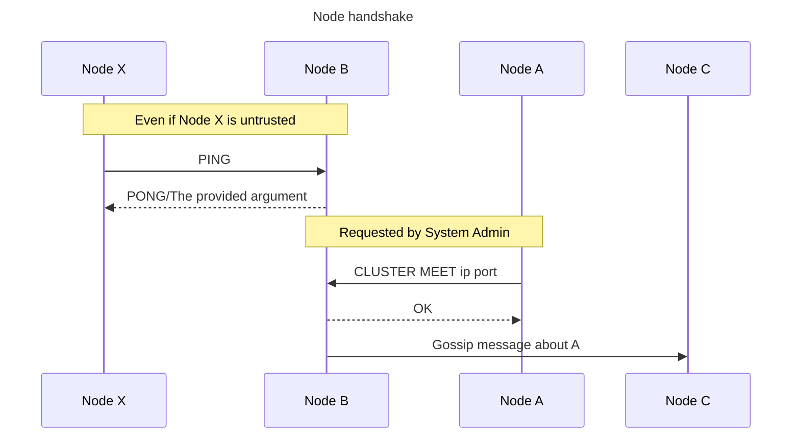
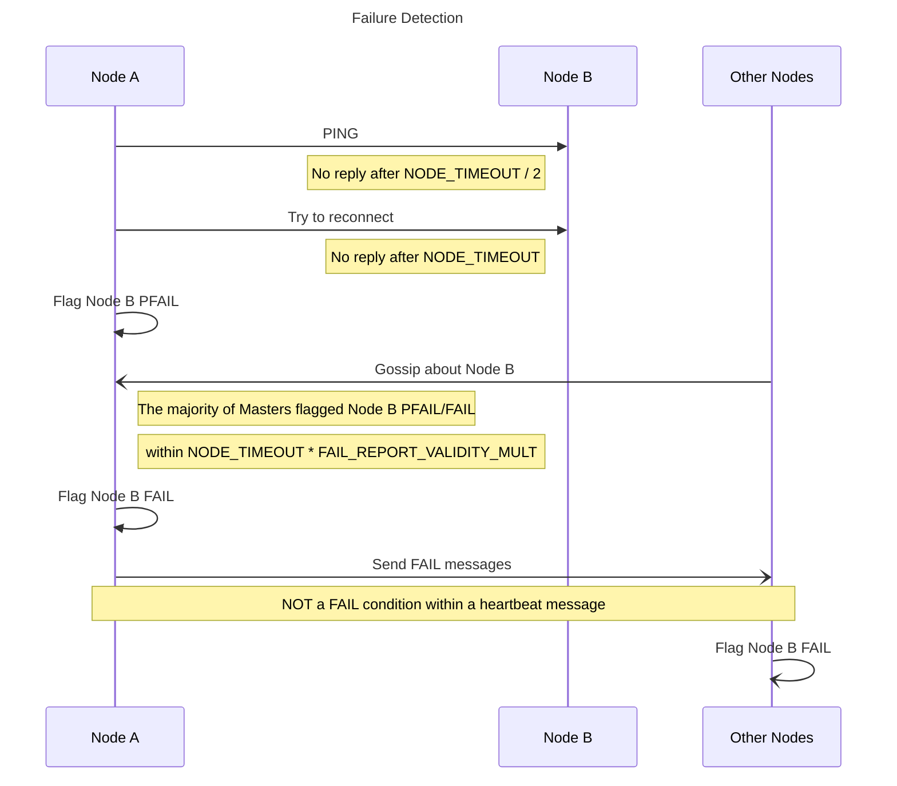
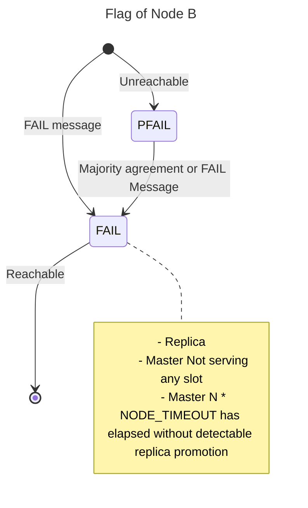
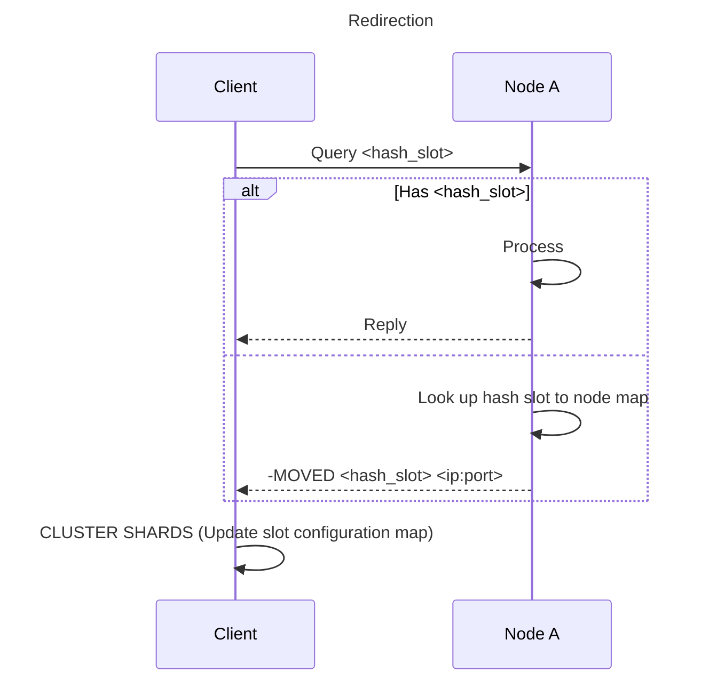
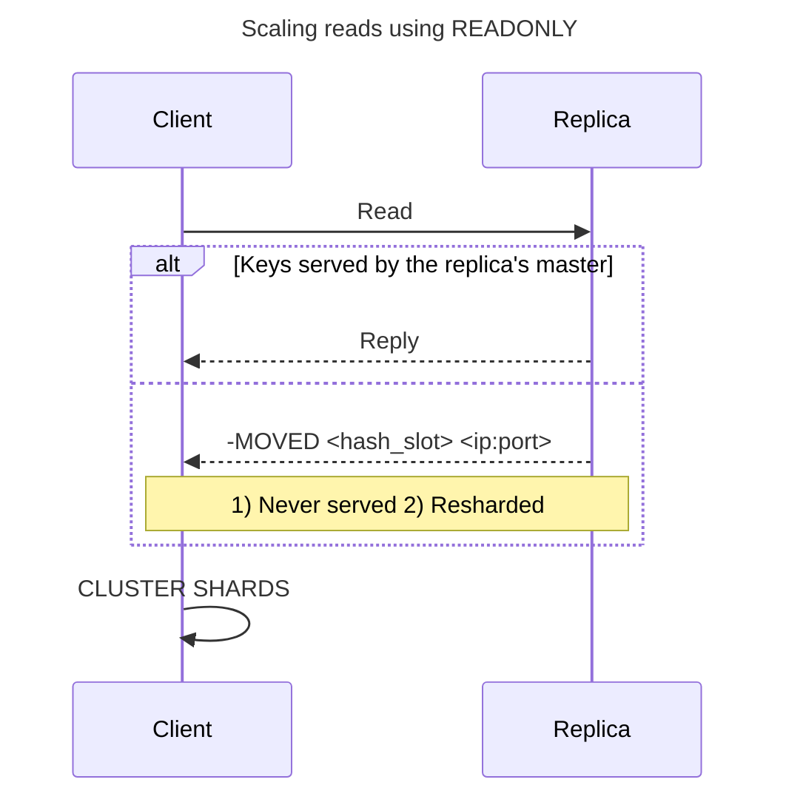
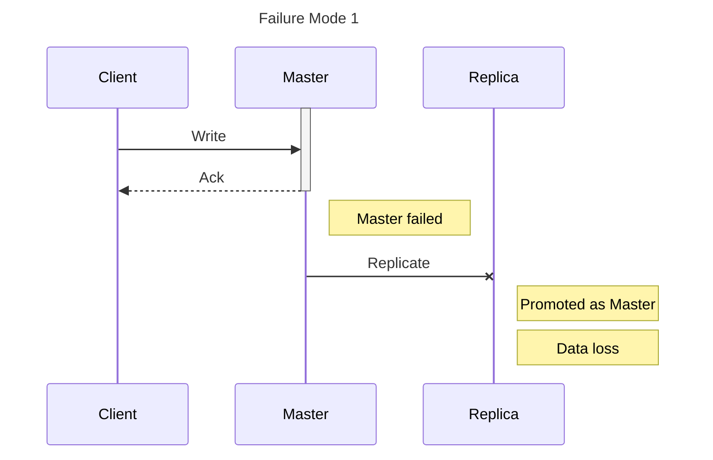
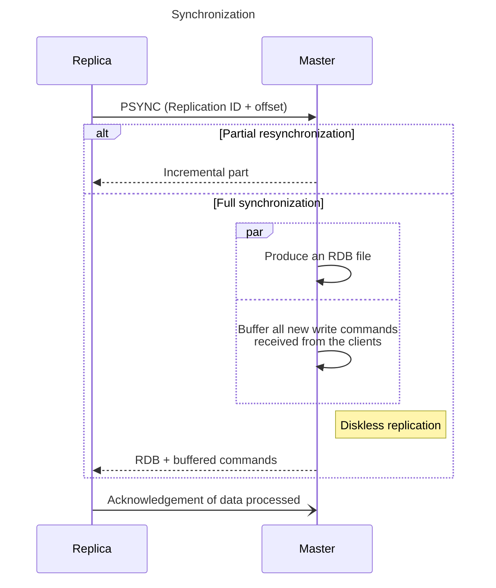
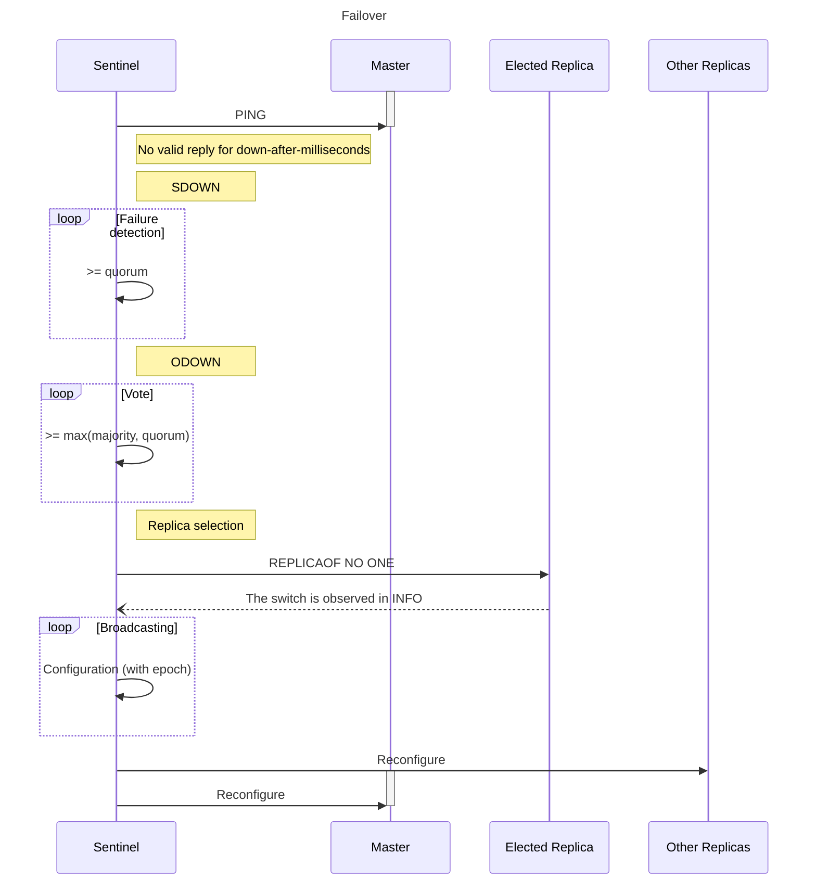
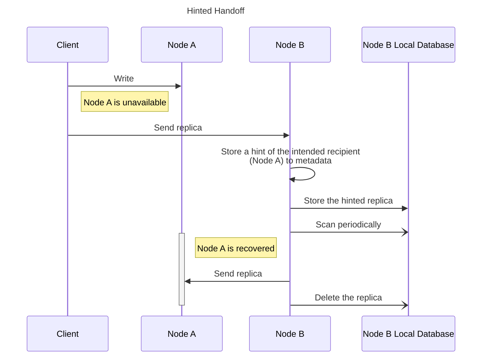

## Redis

{: w="150" }
_Redis (Remote Dictionary Server)_


* [Documentation](https://redis.io/docs/)
* [Redis Cluster](https://redis.io/docs/reference/cluster-spec/)
* [Interview questions](https://gist.github.com/aershov24/16f4e369a93182de3f235a9a154a6b4a)

In-memory key-value data store. Stores cache data into physical storage if needed.

Executes ultra-fast LUA scripts.

Supports [blocking queues](https://redis.io/commands/blpop/).

Single threaded: an individual command is always atomic
Provide concurrency at the I/O level by I/O multiplexing + even loop. Atomicity is at no extra cost (doesn't require synchronization between threads)
CPU is usually not the bottleneck. IT's either memory or network bound.
Redis 4.0 more threaded: deleting objects in the background, blocking commands implemented via Redis modules

Pipelining (vs batching?) Redis commands

Multi/exec sequence ensures no other clients are executing commands in between.

Transactions: MULTI, EXEC, DISCARD, WATCH
Rollback is not supported

Atomicity

[CRDTs](https://redis.com/blog/diving-into-crdts/): Conflict-Free Replicated Data Types

TCP ports
* Redis TCP port: node to clients
* Cluster bus port: node to node
  * Redis Cluster Bus
  * Binary protocol (*Gossip*)
  * Full mesh
  * Propagate information about the cluster
    * Discover new nodes
    * Send ping packets for failure detection
    * Configuration updates
    * Failover authorization
    * Propagate Pub/Sub messages



Heartbeat
* `PING` and `PONG` packets
* Every node:
  * pings a few random nodes every second
  * makes sure to ping every other node that hasn't sent a ping or received a pong for `> NODE_TIMEOUT / 2`





### Data persistence

* RDB: snapshots
  * `dump.rdb` by default
  * Manual commands: `SAVE`/`BGSAVE`
  * `fork()` using a child process
* AOF (Append Only Files)
  * `fsync` policies
  * Log rewriting: `BGREWRITAOF`
  * More *durable* (how much data you can afford to lose)

### Scaling

[Scaling](https://redis.io/docs/manual/scaling/)

Algorithmic sharding:
```
HASH_SLOT = CRC16(key) mod 16384
```

*hash tags* force certain keys to be stored in the same hash slot



Resharding

`READONLY`: client is OK reading possibly stale data and it not interested in running write queries. Replica nodes will not redirect client to the authoritative master for the hash slot involved in the given command.



### Replication

[Replication](https://redis.io/docs/manual/replication/): Master-replica (Leader-follower)

Asynchronous replication by default.

Not *strong consistency*!



Synchronous replication is supported when absolutely needed, via `WAIT`. But it's always possible that a replica that was not able to receive the write will be elected as master. So it's *not* strong consistency.

Actions that change master dataset:
* client writes
* keys expired or evicted
* others

Master-replica link breaks (due to network issues or timeout): partial resynchronization



### Failure Detection

`NODE_TIMEOUT`
* Unresponsive master node is considered to be failing and can be replaced by one of its replicas
* If a master node cannot sense the majority of the other masters, it enters error state

### Pub/sub

`SUBSCRIBE`, `UNSUBSCRIBE` and `PUBLISH`.

*at-most-once* message delivery semantics

Messages are *sharded*.

#### Redis Streams

### Redis Sentinel

Provides high availability for Redis when not using Redis Cluster.

[Redis Sentinel](https://redis.io/docs/management/sentinel/)
* Automatic failover: high availability
* Monitoring
* Notification
* Configuration provider


Redis + Sentinel as a whole are an *eventually consistent* system where the merge function is *last failover wins*.



## Memcached

{: w="150" }

## Apache Kafka

{: w="150" }
_Apache Kafka_

* [Documentation](https://kafka.apache.org/documentation/)
* [Interview questions](https://www.interviewbit.com/kafka-interview-questions/)

Records -> Topic
* Topics are separated into partitions
* Partition: append-only sequence of records arranged chronologically
* Each record is given an offset
* A single topic can contain multiple partition logs (parallel processing)
* Topic's default retention time: 7 days

Replication
* A replica is the redundant element of a topic partition
* Each partition contains one or more replicas across brokers
* Each partition has Leader + Followers
* Per partition, "at least one" delivery semantics
* ISR: In-Sync Replica. A replica that has been out of ISR for a long period of time indicates that the follower is unable to fetch data at the same rate as the leader
* Geo-Replication: MirrorMaker

Brokers -> Cluster
* Managed by Apache ZooKeeper
* Each broker handles GB (~10^5 count) R/W /s
* Broker leader election
* Stateless
* Multi-tenant: allow for many topics on the same cluster.
* Unbalanced cluster
  * Leader skew. Solutions:
    * auto.leader.rebalance.enable=true
    * Kafka-preferred-replica-election.sh
  * Broker skew. Solutions:
    * Partition reassignment tool

Producers
* Transmit JSON-format data to broker is in a compressed batch
  * Batch size
  * Liner duration

Consumers -> Consumer Group
* Pull model
* For a topic, #(customers) == #(partitions) to ensure consumers keep up with producers

Maximum message size: 1MB
High throughput: millions of messages per second

* Fault-tolerant storage
* Pub/sub
* Monitor metrics/security logs
* Stream processing (inefficient for data transformations)

Kafka Schema Registry: ensures the (Avro) schema used by the consumer and the producer are identical. The producer submits the schema ID using the Confluent schema registry in Kafka.

* Log compaction
  * For each topic partition, at least the last known value for each message key within the log of data is kept.
  * Restoration

* Quotas
  * Byte-rate limits that are set for each client-id
  * Prevent a single application from monopolizing broker resources

## RabbitMQ

{: w="150" }

# Database

## Amazon DynamoDB

{: w="150" }

[Dynamo Paper](https://www.allthingsdistributed.com/2007/10/amazons_dynamo.html)

### Data Versioning

Vector clock
* (node, count)
* Clock truncation scheme

### Handling Failures

Sloppy quorum: all read and write operations are performed on the first N *healthy* nodes from the preference list



## Apache Cassandra

{: w="250" }

* [Basics](https://cassandra.apache.org/_/cassandra-basics.html)
* [Documentation](https://cassandra.apache.org/doc/latest/)
* [Interview questions](https://www.edureka.co/blog/interview-questions/cassandra-interview-questions/)

PiB+

Cluster: container for Keyspaces (database)

Replication:
Multi-master replication using versioned data and tunable consistency
* Strategy
  * Simple Strategy: Partitioner determines the node for the first replica; additional replicas are placed on the next nodes in the Ring clockwise
  * Network Topology Strategy: consider rack or datacenter locations

Column family: a container for an ordered collection of rows
Row: an ordered collection of columns
* Row key
* Column keys
* Column values

Primary Key
* Single Primary Key
* Compound Primary Key
  * Partitioning Key + Clustering Key
  * Clustering is the process that sorts data in the partition
* Composite Partitioning Key

Gossip Protocol
* Failure detection

### Data Partitioning (Dynamo Style)

LWW-Element-Set CRDT (Last-Write-Wins)

The default partitioner is the Murmur3Partitioner ([MurmurHash](https://en.wikipedia.org/wiki/MurmurHash))

**Consistent Hashing**
* vnode
  * The more tokens, the higher the probability of an outage
  * Cluster-wide maintenance operations are often slowed
  * Performance of operations that span token rangs could be affected

Consistency
* Tunable

Inconsistency Repair
* Anti-entropy: compare the data of all replicates and update them with the newest version using Merkle Tree
* Read: fix at the time of read request (newer nodes overwrites older nodes)
* Incremental: only repair the data that's bee nwriteen since the previous incremental repair


Snitch: determines which datacenters and racks, nodes belong to, informing Cassandra about the network topology

Storage Engine: based on a Log Structured Merge Tree (LSM)
* CommitLog: append-only log of all mutations local to a node
* MemTables: in-memory structures where Cassandra buffers writes
  * One active memtable per table
* SSTables: the immutable data files that Cassandra uses for persisting data on disk
  * Cassandra triggers compactions which combine multiple SSTables into one

* Write: CommitLog -> MemTables -> SSTable
* Read: Bloom Filter -> Partition Key Cache -> Partition Index

Incremental scale-out on commodity hardware

## MongoDB

{: w="150" }

## Apache HBase
Wide column. Time series data

## InfluxDB
Time series data

# Distributed File System

## Apache Hadoop File System (HDFS)

Availability
Scalability
Performance

CAP Theorem: Consistency, Availability and Parition Tolerance

Distributed cache:
* Dedicated cache cluster
* Co-located cache

MemCacheD

Shards: consistent hashing (cache client, server (Redis) or cache proxy (Twemproxy))
e.g. MurmurHash
Drawbacks:
* Domino effect
* Uneven server distribution

Solution: 
* add each server on the circle multiple times
* Jump Hash algorithm (Google)
* Proportional Hash (Yahoo!)
Possible problem: hot shard

Hot partition solution:
* include event time to the parition key
* Split hot parition into more partitions
* Dedicated parition for popular items

Configuration management tool
* [Chef](https://docs.chef.io/)
* Puppet

Configuration Service:
* Apache ZooKeeper

Data replication: availability
Protocols:
* Probabilistic: gossip, epidemic broadcast tree, bimodal multicase
  * Eventual consistency
* Consensus: 2 or 3 phase commit, Paxos, Raft, chain replication
  * Strong consistency

Leader-Follower replication:
* Leader: put, get
* Follower: get (deals with hot shards problem)

Leader election:
* Configuration service (Apache ZooKeeper, Redis Sentinel)
* Implement in cluster

Data replication is asynchronous, which may cause failures or inconsistency

Source of inconsistency:
* Asynchronous data replication
* Inconsistent server list

Expired items:
* Passive expire: remove when read them
* Active expire: a thread runs periodically to clean. If dataset is too big, test a several items use probablistic algorithms at every run

Firwall to protect cache server ports
Cache elements can be encrypted

Databases ca  handle millions of requests per second (source?)

MapReduce

# Distributed Coordination Service

* Synchronization
* Configuration maintenance
* Groups and naming

## Apache ZooKeeper


[Apache ZooKeeper](https://zookeeper.apache.org/): high performace, high availability, strictly ordered access.

* Shared hierarchical namespace (file system)
* Data registers - znodes (files and directories)
* Data are in-memory (high throughput, low latency)

Replication:
Ensemble: servers must all know about each other

* In-memory image: state
* Persistent storage: transaction logs and snapshots

ZooKeeper transactions (clients update data on znodes):

* Sequential consistency: transactions are stamped with a number that reflects the order
* Atomicity: Znode data reads/writes are atomic.
* Single System Image: a client's view of the service keeps the same regardless of the server that it connects to
* Reliability: an update persists from being applied until a client overwrites it
* Timeliness: the clients view of the system is guaranteed to be up-to-date within a certain time bound

Works best for read-dominant workload: (r/w ration = 10:1)

Znode stat structure includes:
* Version numbers for data changes
* ACL changes
* Timestamps

Znodes
* Persistent Znodes
* Ephemeral nodes are znodes that live only when the session that created the znode is alive
* Sequential Znodes: appens an increasing counter to the path's end. Can be either persistent or ephemeral

Leader election: Sequential feature??

Client maintains a TCP connection to a znode. It can set a watch on a zonde that will be triggered when the znode changes.

Read requests are serviced from the local replica of each server database. Requests that change the state of the service, write requests, are processed by an agreement protocol.

All write requests from clients are forwarded to a single server, called the leader. The rest of the ZooKeeper servers, called followers, receive message proposals from the leader and agree upon message delivery. The messaging layer takes care of replacing leaders on failures and syncing followers with leaders.

custom atomic messaging protocol


Counter-based algorithms
* Count-min sketch
* Lossy counting
* Sapce saving
* Sticky sampling

Lambda Architecture
Nathan Marz, Apache Storm,
Jay Kreps, Apache Kafka

# Stream Processing Framework

## Apache Spark

## Apache Flink

Front-end
* Request valiation
* Authentication/Authorization
* TLS termination
* Server-side encryption
* Caching
* Rate limiting
* Request dispatching
* Request deduplication
* Usage data collection

* Users/Customers
  * Who
  * How
* Scale
  * Requests per second
  * Traffic spikes
* Performace
  * Latency
* Cost
  * Development cost
  * Maintenance cost

SQL:
Normalization
Sharding, Cluster proxy (configuration service),
shard proxy
* Cache
* Monitor health
* Publish metris
* Terminate long queries 
Vitess (YouTube)

SQL
* ACID transactions
* Complex dynamic queries
* Data analytics
* Data warehousing

NoSQL
* Easy scaling for both writes and reads
* Highly available
* Tolerate network partitions

Some keywords:
* Scalable: partitioning
* Reliable: replication and checkpointing
* Fast: in-memory

Data enrichment
Embedded database (LinkedIn): RocksDB

Client
* blocking: create one thread for each new connection, easy to debug
* non-blocking I/O

Batching:
* increases throughput
* saves on cost
* request compression

Timeouts
* connection timeout: tens of ms
* request timeout: exponential backoff and jitter
  * Circuite Breaker: prevents repeat retries

Resource dispatching
* Bulkhead pattern: isolates elements of an application into pools.

Load balancers
* Round robin
* Least connections
* Least response time
* Hash-based

Service discovery:
* Server-side: load balancer
* Client-side
  * Service registry (e.g. Apache ZooKeeper, Netflix Eureka)
  * Gossip protocol

Replication
* Single leader: SQL scaling
* Multi leader: (TBD)
* Leaderless: Apache Cassandra

Binary formats:
* Thrift: tag
* Protocol buffers: tag
* Avro

Storage strategy: Data rollup
Hot/Cold storage
Data federation

Clients:
* Netty: Non-blocking I/O
* Netflix Hystrix
* Polly

Load balancer:
* NetScaler: hardware
* NGINX: software

Performace testing
* Load testing
* Stress testing: find break point
* Soak testing: find leaking resources
Apache JMeter to generate load

Monitoring:
* Latency
* Traffic
* Errors
* Saturation

Audit System:
* Weak: Canary
* Strong: Different path, Lambda Architecture

Queue message deletion:
* Offset (Apache Kafka)
* Mark as invisible so other cosumers won't see it. The consumer who retrieved the message deletes it explicitly, otherwise it becomes visible again (AWS SQS)

Message delivery:
* At most once
* At least once
* Exactly once (hard to achieve)

Message sharing
* Broadcasting (full mesh)
* Gossip protocol (< several thousands)
* Redis
* Coordination service

Service + Daemon

maxmemory: write commands starts to fail or evict keys

```java
```

[number-of-distinct-roll-sequences]: https://leetcode.com/problems/number-of-distinct-roll-sequences/
