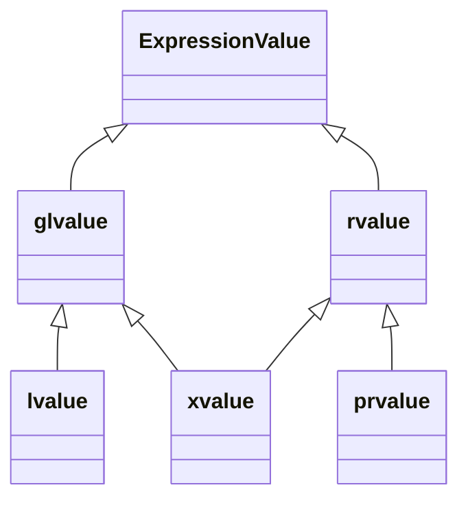
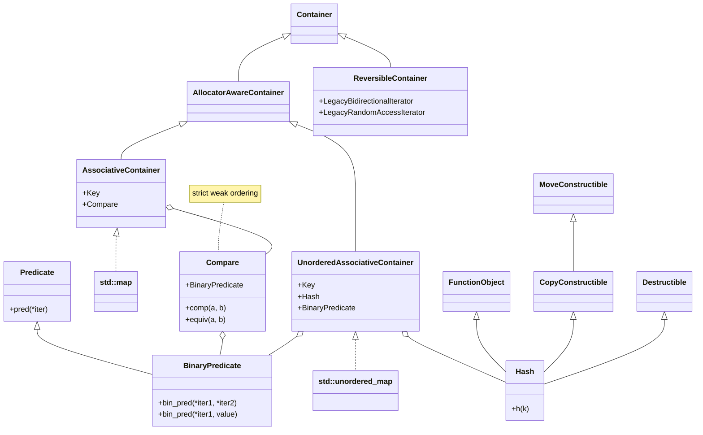
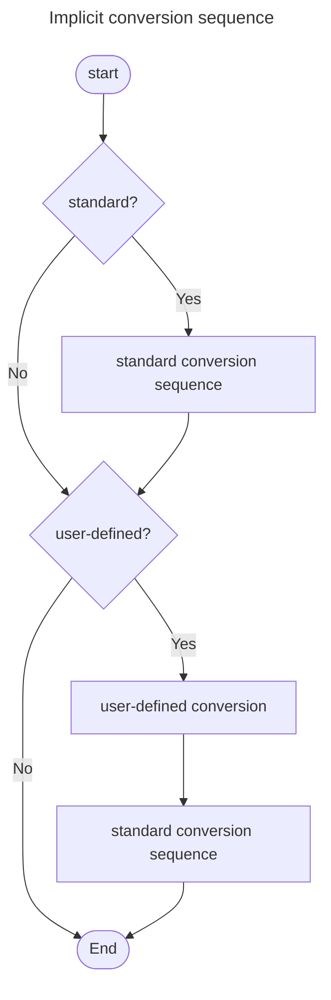
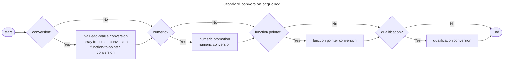

Dan Saks. (2001). _[Lvalues and Rvalues](https://www.embedded.com/lvalues-and-rvalues/)_
: * Lvalue-ness is a compile-time property
  * Every expression is either an lvalue or an rvalue
  * An object is a manipulatable region of storage; an lvalue is an expression referring to an object
  * Compilers can assume that rvalues don’t necessarily occupy storage
    + Exception: in C++, rvalues of a class type do refer to objects
  * Assignment
    + The left operand must be an lvalue
    + The right operand can be an lvalue (lvalue-to-rvalue conversion) or rvalue

David Anderson. (1994). _[The ``Clockwise/Spiral Rule''](https://c-faq.com/decl/spiral.anderson.html)_
: A technique to parse C declarations



* glvalue
  + may be implicitly converted to prvalue
  + may be polymorphic
  + can have incomplete type

* rvalue
  + cannot be taken by address-of operator
  + cannot be used as left-hand operand of assignment and compound assignment operator

A reference is essentially a pointer that’s automatically dereferenced each time it’s used.

# Object

## Storage Duration

[Storage duration](https://en.cppreference.com/w/cpp/language/storage_duration)

```mermaid
graph TD
    subgraph Specifiers
    no_specifier[no specifier]
    static_sp[static]
    extern
    thread_local
    classDef Specifier fill:#cad1af,stroke:#333,stroke-width:2px;
    class auto,static_sp,extern,thread_local Specifier;
    style no_specifier fill:#cad1af,stroke:#333,stroke-width:2px,stroke-dasharray: 5 5
    end

    subgraph Storage Duration
    automatic
    static_sd[static]
    thread
    dynamic
    classDef StorageDuration fill:#ffa700,stroke:#333,stroke-width:2px;
    class automatic,static_sd,thread,dynamic StorageDuration;
    end

    subgraph Linkage
    internal
    external
    module
    end

    subgraph Scopes
    block_sc[[block]]
    namespace_sc[[namespace]]
    classDef Scope fill:#ffb7c5,stroke:#333,stroke-width:2px;
    class block_sc,namespace_sc Scope;
    end
    
    no_specifier--->automatic
    static_sp--->static_sd
    static_sp--->thread
    extern--->static_sd
    extern--->thread
    thread_local--->thread

    internal---static_sp
    internal-.extern names in <br> a. an unnamed namespace or <br>b. a namespace within an unnamed namespace.-extern
    external-.static class members not in an unamed namespace.-static_sp
    external---extern

    automatic---block_sc
    static_sd---namespace_sc
```

| Storage Duration | Duration | Object Initialization
| ***automatic*** | Enclosing block scope | |
| ***static*** | Program | |
| ***thread*** | Thread | |
| ***dynamic*** | Dynamic memory allocation | new-expression |







```c++
basic_string(size_type count, CharT ch, const Allocator& alloc = Allocator())
```
