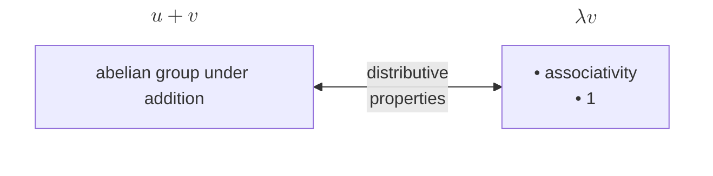
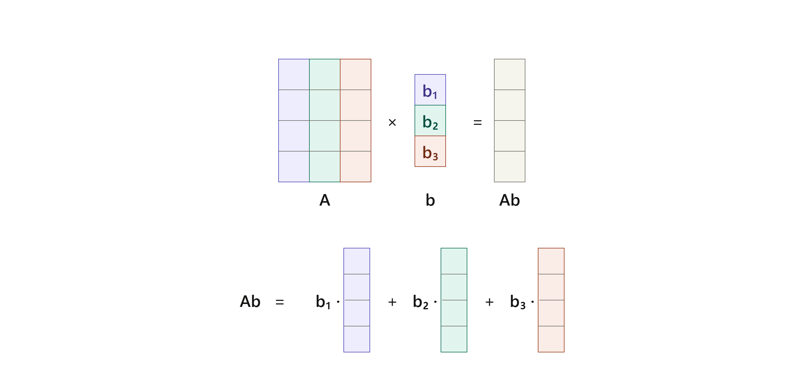
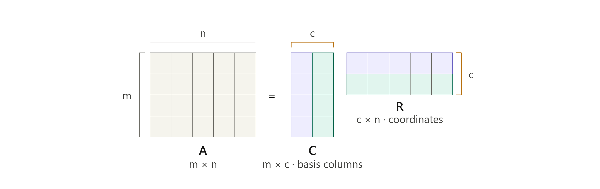

## Vector Space

### Definition

Motivation: properties of addition and scalar multiplication in $ \mathbf{F}^n $

{: .prompt-tip }
> Examples

* $ \mathbf{F}^S $
* $ \mathcal{P}(\mathbf{F}) $
* $ \mathcal{P}_m(\mathbf{F}) $
* $ \mathcal{L}(V, W) $ ($ \dim = (\dim V)(\dim W) $)
* $ \mathbf{F}^{m,n} $ ($ \dim = mn $)
* $ V_1 \times \dots \times V_m $ ($ \dim = \dim V_1 + \dots + \dim V_m $)
* $ V' $ ($ \dim = \dim V $)

### Subspace

{: .prompt-tip }
> Examples

* $ V_1 \cap \dots \cap V_m $
* $ V_1 \cup V_2 $ ($ \Leftrightarrow V_1 \subseteq V_2 $ or $ V_1 \supseteq V_2 $)
* $ V_1 + \dots + V_m $ (Smallest containing subspace)
* $ E(\lambda, T) $

Suppose $V$ is finite-dimensional and $ U $ is a subspace of $ V $:

|               | $ \dim $                                  |
| ------------- | ----------------------------------------- |
| $ U $         | $ \leq \dim V $ ($ = \dim V \iff U = V $) |
| $ V/U $       | $ \dim V - \dim U $                       |
| $ U^0 $       | $ \dim V - \dim U $                       |
| $ U^{\perp} $ | $ \dim V - \dim U $                       |

### Sum

Analogy between sets and vector spaces:

* Cardinality: Dimension
* Union: Sum
* Union of disjoint sets: Direct sum

### Number of Vectors

The number of vectors equals the number of choices of the coefficient tuple $(a_1, \dots, a_n)$:

$$\#(\text{vectors}) = \lvert \mathbf{F} \rvert ^n$$

Finite fields exist precisely for prime-power sizes $q = p^k$.

|                      | over $\mathbb{R}$ or $\mathbb{C}$ | over $\mathbf{F}_q$                                                   |
| -------------------- | --------------------------------- | --------------------------------------------------------------------- |
| trivial space        | $1$                               | $1$                                                                   |
| dimension $n \geq 1$ | $\infty$                          | $q^n$                                                                 |
| #{ordered bases}     | $\infty$                          | $$ \lvert GL_n(\mathbf{F}_q) \rvert = \prod_{k=0}^{n-1}(q^n - q^k) $$ |

## Bases

{: .prompt-warning }
> Suppose we allow infinite families, read "spans/independent" in the finite-linear-combination sense, and read "length $= \dim V$" as "cardinality equals $\dim V$" (a Hamel basis).
>
> (a) Take $V = \mathcal P(\mathbb F)$, polynomials, with basis $1, x, x^2, \dots$ so $\dim V = \aleph_0$. Then $\{x, x^2, x^3, \dots\}$ (drop the constant) is linearly independent with cardinality $\aleph_0 = \dim V$, yet it can't produce the constant $1$, so it doesn't span — independent, right size, not a basis.
>
> (b) $\{1, x, x^2, \dots\} \cup \{1+x\}$ spans and still has cardinality $\aleph_0$, but it's dependent — spanning, right size, not a basis.

{: .prompt-info }
> A direct-sum decomposition of $ V $ is the same thing as a partition of a basis of $ V $.

{: .prompt-tip }
> $ \dim (V_1 + \dots + V_m) \le \dim V_1 + \dots + \dim V_m $

A sum is a direct sum iff dimensions add up.

---

## Linear Maps

{: .prompt-tip }
> Examples

* $ T : V \to W $
* $ \Gamma : V_1 \times \dots \times V_m \to V_1 + \dots + V_m $ (Invertible iff $ V_1, \dots, V_m $ is a direct sum)
* Quotient map: $ \pi : V \to V/U $, $ \pi(v) = v + U $
  * $ \tilde{T} ∶ V/(\operatorname{null} T) \to W $, $ \tilde{T}(v + \operatorname{null} T) = Tv $
  * $ \tilde{T} \circ \pi = T $
* $ T \to T' $
* $ P_U \in \mathcal{L}(V) $
* $ (\operatorname{null} T)^{\perp} \to \operatorname{range} T $ (Invertable)
* $ T^{\ast} $

{: .prompt-info }
> A linear map may be prescribed freely on a *basis*:
>
> Suppose $ v_1, \dots, v_n \in V $ is a basis of $ V $ and $ w_1, \dots, w_n \in W $, $ \exists! T \in \mathcal{L}(V, W) \ \text{s.t.} $
>
> $$ Tv_k = w_k $$
>
> for each $k = 1, \dots, n$

{: .prompt-tip }
> $ T(c_1v_1 + \dots + c_nv_n) = c_1w_1 + \dots + c_nw_n $

{: .prompt-info }
> Extension
>
> $ V $ is finite-dimensional:
>
> $ U $ is a subspace of $ V $, $ S \in \mathcal{L}(U, W) \Rightarrow \exists T \in \mathcal{L}(V, W) \ \text{s.t.} \ T \vert _U = S $
>
> Extend a basis $ u_1,\dots,u_m$ of $U $ to a basis $ u_1,\dots,u_m,\,v_1,\dots,v_n $ of $ V $. Define $ T u_i = S u_i $ and $ T v_j = $ anything in $ W $; extend linearly.

### Algebraic Operations

* $ \mathcal{L}(V, W) $ is a vector space
* Product of linear maps is a [bilinear map](https://en.wikipedia.org/wiki/Bilinear_map)

### Null Spaces and Ranges

{: w="400" h="200" }

{: .prompt-info }
> **Fundamental theorem of linear maps**
>
> Suppose $V$ is finite-dimensional. $ T \in \mathcal{L}(V, W) $:
>
> $$ \dim V = \dim \operatorname{null} T + \dim \operatorname{range} T $$

{: .prompt-tip }
> *Generalization*
>
> Suppose $V$ is finite-dimensional. $ T \in \mathcal{L}(V, W) $, $ U $ is a subspace of $ W $:
>
> $$ \dim \{ v \in V : Tv \in U \} = \dim \operatorname{null} T + \dim (U \cap \operatorname{range} T) $$

###  Injectivity, Surjectivity and Invertibility

_Inveritibility Triangle_

{: .prompt-warning }
> In infinite dimensions $ST = I$ does **not** imply $TS = I$. The standard counterexample is the shift operators on infinite sequences: left‑shift $L$ and right‑shift $R$ satisfy $LR = I$ but $RL \ne I$, and neither is invertible.

{: .prompt-info }
> Suppose $ T \in \mathcal{L}(V, W) $.
>
> (a) If $ T $ is injective, the co-restriction $ \tilde T : V \to \operatorname{range} T $, $ v \mapsto Tv $, is a bijection.
>
> (b) Decompose $ V = \operatorname{null} T \oplus U $, then $T\rvert_U : U \to \operatorname{range} T$ is an isomorphism.

$ \iff $

| $ T \in \mathcal{L}(V, W) $             | Injective                                                                                           | Surjective                                                                                          | Invertible (Isomorphic)                                                          |
| --------------------------------------- | --------------------------------------------------------------------------------------------------- | --------------------------------------------------------------------------------------------------- | -------------------------------------------------------------------------------- |
| Definition                              | $ \operatorname{null} T = {0} $                                                                     | $ \operatorname{range} T = W $                                                                      | $ T $ is injective and $ T $ is surjective                                       |
| Preservation                            | linear independence                                                                                 | spanning                                                                                            | basis                                                                            |
| Inverse                                 | $ T $ has a left inverse: $ ST = I $                                                                | $ T $ has a right inverse: $ TS = I $                                                               | $ T $ has the inverse: $ ST = I $ and $ TS = I $                                 |
| Dual map                                | $ T' $ is surjective                                                                                | $ T' $ is injective                                                                                 | $ T' $ is invertible                                                             |
| $ \mathcal{M}(T) \in \mathbf{F}^{m,n} $ | columns linearly independent;   rows span $ \mathbf{F}^{1,n} $;   $ \operatorname{rank} = n $ | rows linearly independent;   columns span $ \mathbf{F}^{m,1} $;   $ \operatorname{rank} = m $ | columns are a basis;   rows are a basis;   $ \operatorname{rank} = m = n $ |
| Singular value                          | $ 0 $ is not a singular value of $ T $                                                              | \#(positive singular values of $ T $) = $ \dim W $                                                  |                                                                                  |

$ \implies $

| $ T \in \mathcal{L}(V, W) $ | Injective              | Surjective             | Invertible (Isomorphic)             |
| --------------------------- | ---------------------- | ---------------------- | ----------------------------------- |
| Dimensions (Finite)         | $ \dim V \leq \dim W $ | $ \dim V \geq \dim W $ | $ \dim V = \dim W $                 |
| **$\dim V = \dim W$**       | (all three coincide)   | (all three coincide)   | (all three coincide)                |
| Pseudoinverse               | $ TT^{\dagger} = I $   | $ T^{\dagger}T = I $   | $ TT^{\dagger} = T^{\dagger}T = I $ |

{: .prompt-info }
> $ \lambda $ is an eigenvalue of $ T \iff T - \lambda I $ is not invertible

### Product

Suppose $U$ and $V$ are finite-dimensional. $ S \in \mathcal{L}(V, W) $ and $ T \in \mathcal{L}(U, V) $:

* $ \operatorname{null} T \subseteq \operatorname{null} ST $
* $ \operatorname{range} ST \subseteq \operatorname{range} S $

Suppose $ U $ and $ V $ are finite-dimensional. $ S \in \mathcal{L}(V, W) $ and $ T \in \mathcal{L}(U, V) $:

* $ \dim \operatorname{null} ST \leq \dim \operatorname{null} S + \dim \operatorname{null} T $
* $ \dim \operatorname{range} ST \leq \min(\dim \operatorname{range} S + \dim \operatorname{range} T) $

{: .prompt-info }
> Suppose $ V $ is finite-dimensional and $ S, T \in \mathcal{L}(V, W) $, then
>
> $ ST $ is invertible $\iff$ $ S $ and $ T $ are invertible.

### Translate

{: .prompt-info }
> *Re-basing*
>
> Suppose $ U $ is a subspace of $ V $ and $ v,w \in V $. Then
>
> $$ x \in v + U \Leftrightarrow x + U = v + U. $$

{: .prompt-tip }
> Corollary: Two translates of a subspace are equal or disjoint.
>
> $$ v - w \in U \Leftrightarrow v + U = w + U \Leftrightarrow (v + U) \cap (w + U) \ne \emptyset $$
>
> $$ v \in U \Leftrightarrow v + U = 0 + U. $$

{: .prompt-tip }
>  Suppose $ A_1 = v + U_1 $ and $ A_2 = w + U_2 $ for some $ v,w \in V $ and some subspaces $ U_1,U_2 $ of $ V $.
>
> $$ \forall x \in A_1 \cap A_2, \ A_1 \cap A_2 = (x + U_1) \cap (x + U_2) = x + (U_1 \cap U_2). $$

### System of linear equations

{: .prompt-info }
> For $A \in \mathbf{F}^{m\times n}$ and one particular $b \in \mathbf{F}^n$, then
>
> $Ax = b$ has exactly one solution $\iff$ ($ A $ injective) and ($ b \in \operatorname{range} A $).

{: .prompt-info }
> Suppose $ T \in \mathcal{L}(V,W) $ and $ c \in W $, then
>
> $ {x \in V : Tx = c} $ is either the empty set or is a translate of $ \operatorname{null} T $.

{: .prompt-tip }
> Special case: system of linear equations
>
> general solution = particular solution + homogeneous solution
>
> $ V/\operatorname{null} T \cong_\tilde{T} \operatorname{range} T $

#### Bases

{: .prompt-info }
> Suppose $ U $ and $ W $ are subspaces of $ V $ and $ V = U \oplus W $. $\pi\|_W : W \to V/U$ is an **isomorphism**.

{: .prompt-info }
> *Duality (Project, function)*
>
> Suppose $ U $ and $ W $ are subspaces of $ V $ and $ V = U \oplus W $. Suppose $ w_1, \dots, w_m $ is a basis of $ W $. Then $ w_1 + U, \dots, w_m + U $ is a basis of $ V/U $.

{: .prompt-info }
> *Duality (Lift, one-to-many)*
>
> Suppose that $ U $ is a subspace of $ V $ such that $ V/U $ is finite-dimensional.
> There exists a finite-dimensional subspace $ W $ of $ V $ such that $ \dim W = \dim V/U $ and $ V = U \oplus W $.

{: .prompt-proof }
> Since $V/U$ is finite-dimensional, pick a basis
>
> $$v_1 + U,\ \dots,\ v_m + U \quad (m = \dim V/U),$$
>
> with chosen representatives $v_1, \dots, v_m \in V$. **Define**
>
> $$W := \operatorname{span}(v_1, \dots, v_m).$$
>
> We show this $W$ works: it's finite-dimensional, $\dim W = m = \dim V/U$, and $V = U \oplus W$.
>
> **The $v_k$ are linearly independent (so $\dim W = m$).** Suppose $\sum_k a_k v_k = 0$. Apply $\pi$:
>
> $$0 + U = \pi\Big(\sum_k a_k v_k\Big) = \sum_k a_k (v_k + U).$$
>
> Since $v_1 + U, \dots, v_m + U$ is a basis of $V/U$, it's independent, so all $a_k = 0$. Thus $v_1, \dots, v_m$ is independent and $\dim W = m = \dim V/U$.
>
> **$U + W = V$.** Let $v \in V$. Expand its coset in the basis: $v + U = \sum_k a_k (v_k + U) = \big(\sum_k a_k v_k\big) + U$. Equal cosets differ by an element of $U$:
>
> $$v - \sum_k a_k v_k \in U \quad\Longrightarrow\quad v = \underbrace{\Big(v - \sum_k a_k v_k\Big)}_{\in\, U} + \underbrace{\sum_k a_k v_k}_{\in\, W} \in U + W.$$
>
> **$U \cap W = \{0\}$.** Let $x \in U \cap W$. Since $x \in W$, write $x = \sum_k a_k v_k$. Since $x \in U$, $\pi(x) = 0$:
>
> $$0 + U = \pi(x) = \sum_k a_k (v_k + U).$$
>
> Independence of the basis forces all $a_k = 0$, so $x = 0$.
>
> Therefore $V = U \oplus W$ with $\dim W = \dim V/U$. $\blacksquare$

{: .prompt-info }
> Suppose $ U $ is a subspace of $ V $ and $ v_1 + U, \dots, v_m + U $ is a basis of $ V/U $ and $ u_1, \dots, u_n $ is a basis of $ U $. Then $ v_1, \dots, v_m, u_1, \dots, u_n $ is a basis of 𝑉.

### Isomorphism

* $ V/\operatorname{null} T \cong_\tilde{T} \operatorname{range} T $
* $ \mathcal{L}(V, W) \cong \mathbf{F}^{m,n} $
* $ V \cong \mathcal{L}(\mathbf{F}, V) $
* $ V^m \cong \mathcal{L}(\mathbf{F}^m, V) $
* $ V \cong U \times V/U $

---

## Matrices

$ \mathcal{M}(T,(v_1,\dots,v_n),(w_1,\dots,w_m)) \in \mathbf{F}^{m,n} $ is the matrix *representation* of $ T $ with respect to the chosen bases.

$$ Tv_k = \sum_{j=1}^m {A_{j,k}w_j} $$

{: .prompt-tip }
> $ T \in \mathcal{L}(\mathbf{F}^n, \mathbf{F}^m) $, $ \mathcal{M}(T,(e_1, \dots, e_n), (e_1, \dots, e_m))_{\cdot,k} = Te_k $

{: .prompt-info }
> Column of matrix product equals matrix times column

{: .prompt-info }
> Linear combination of columns

{: .prompt-info }
> $ \dim \operatorname{range} T = \operatorname{rank} \mathcal{M}(T) $

{: .prompt-info }
> Column–row factorization

$ C $ is a *basis* of the column space.

{: .prompt-tip }
> $ A \mapsto A^T $ is a linear map

{: .prompt-info }
> Change-of-basis

$$ \mathcal{M}(I,(u_1,\dots,u_n),(v_1,\dots,v_n))\mathcal{M}(I,(v_1,\dots,v_n),(u_1,\dots,u_n)) = I $$

$ T \in \mathcal{L}(V) $, $ A = \mathcal{M}(T,(u_1,\dots,u_n)), B = \mathcal{M}(T,(v_1,\dots,v_n)), C = \mathcal{M}(I,(u_1,\dots,u_n),(v_1,\dots,v_n))$:

$$ A = C^{-1}BC $$

| $ T \in \mathcal{L}(V, W) $ | Inverse                                         | Dual Map                                 | Adjoint                                         |
| --------------------------- | ----------------------------------------------- | ---------------------------------------- | ----------------------------------------------- |
| Existence                   | _Inveritibility Triangle_                       |                                          |                                                 |
| Uniqueness                  | $ T^{-1} \in \mathcal{L}(W, V) $                |                                          |                                                 |
| Matrix                      | $ \mathcal{M}(T^{-1}) = (\mathcal{M}(T))^{-1} $ | $ \mathcal{M}(T') = (\mathcal{M}(T))^t $ | $ \mathcal{M}(T^{\*}) = (\mathcal{M}(T))^{\*} $ |
| Involution                  | $ (T^{-1})^{-1} = T $                           |                                          | $ (T^{\*})^{\*} = T $                           |
| Anti-homomorphism           | $ (ST)^{-1} = T^{-1}S^{-1} $                    | $ (ST) = T'S' $                          | $ (ST)^{\*} = T^{\*}S^{\*} $                    |

|                                                       | $ \mathbb{C} $                                  | $ \mathbb{R} $                                                                           |
| ----------------------------------------------------- | ----------------------------------------------- | ---------------------------------------------------------------------------------------- |
| Polynomial factorization (_unique_)                   | $ p(z) = c(z - \lambda_1)\dots(z - \lambda_m) $ | $ p(x) = c(x - \lambda_1)\dots(x - \lambda_m)(x^2 + b_1x + c_1)\dots(x^2 + b_Mx + c_M) $ |
| \#{zeros of a polynomial} (counted with multiplicity) | $ m = \deg p $                                  | $ \le \deg p $                                                                           |
| Existence of eigenvalues ($ \forall T $)              | Nonzero complex vector space                    | Odd-dimension real vector space                                                          |

## Eigenvectors

### Existence

{: .prompt-info }
> Suppose $ T \in \mathcal(V) $. Then every list of eigenvectors of $ T $ corresponding to distinct eigenvalues of $ T $ is _linearly independent_.

{: .prompt-info }
> Null space and range of $ p(T) $ are invariant under $ T $.

{: .prompt-info }
> Eigenvalues are the zeros of the minimal polynomial.

{: .prompt-info }
> Suppose $ T \in \mathcal{L}(V) $. Suppose $ S \in \mathcal{L}(V) $ is invertible.
>
> $$S:\; E(\lambda,\, S^{-1}TS)\;\xrightarrow{\ \sim\ }\; E(\lambda,\, T).$$

{: .prompt-tip }
> $S^{-1}TS$ (conjugation) is just $T$ "viewed in a different basis", and $S$ is the dictionary translating vectors from the new coordinates back to the old. Eigenvalues are basis-independent facts about the operator, so they're untouched; eigenvectors are genuine vectors, so they get translated by the dictionary $S$.

| $ T \in \mathcal{L}(V, W) $ | null space                           | range                               | $ \dim \operatorname{null} $                     | $ \dim \operatorname{range} $   | norm                           |
| --------------------------- | ------------------------------------ | ----------------------------------- | ------------------------------------------------ | ------------------------------- |
| $ T' $                      | $ (\operatorname{range} T)^0 $       | $ (\operatorname{null} T)^0 $       | $ \dim \operatorname{null} T + \dim W - \dim V $ | $ \dim \operatorname{range} T $ |                                |
| $ T^{\*} $                  | $ (\operatorname{range} T)^{\perp} $ | $ (\operatorname{null} T)^{\perp} $ |                                                  |                                 | $ \left\lVert T \right\rVert $ |
| $ T^{\*}T $                 | $ \operatorname{null} T $            | $ \operatorname{range} T^{\*} $     |                                                  | $ \dim T = \dim T^{\*} $        |                                |

## Upper-Triangular Matrices

{: .prompt-info }
> $ \mathcal{M}(T, (v_1, \dots, v_n)) \implies (T - \lambda_1I)\dots(T - \lambda_nI) = 0 $, where $ \lambda_1, \dots, \lambda_n $ are diagonal entries.

{: .prompt-info }
> Sum of eigenspaces is a direct sum.

## Diagonalizability

{: .prompt-info }
> $ T $ is diagonalizable
>
> $ \iff V = \operatorname{null} (T - \lambda I) \oplus \operatorname{range} (T - \lambda I) $.

| $T \in \mathcal{L}(V)$ | Basis                                                                          | Subspaces                                                                                    | Dimensions                            | Minimal polynomial                                                                                                                                     |
| ---------------------- | ------------------------------------------------------------------------------ | -------------------------------------------------------------------------------------------- | ------------------------------------- | ------------------------------------------------------------------------------------------------------------------------------------------------------ |
| Upper-triangularizable | $ Tv_k \in \operatorname{span}(v_1, \dots, v_k) $ for each $ k = 1, \dots, n $ | $ \operatorname{span}(v_1, \dots, v_k) $ is invariant under $T$ for each $ k = 1, \dots, n $ |                                       | $ (z - \lambda_1)\dots(z - \lambda_m) $ for some $ \lambda_1, \dots, \lambda_m \in \mathbf{F} $ (repetitions allowed; $ m = \deg p \le \dim V $)       |
| Diagonalizable         | $\exists$ a basis of $V$ consisting of eigenvectors of $T$                     | $V = E(\lambda_1,T)\oplus\cdots\oplus E(\lambda_m,T)$                                        | $\sum_k \dim E(\lambda_k,T) = \dim V$ | $ (z - \lambda_1)\dots(z - \lambda_m) $ for some list of _distinct_ numbers $ \lambda_1, \dots, \lambda_m \in \mathbf{F} $ ($ m = \deg p \le \dim V $) |

{: .prompt-tip }
> diagonalizable means the eigenspaces are *as big as they can be* — big enough to fill $V$. Each column says "fill $V$" in a different dialect: enough eigenvectors for a basis, eigenspaces summing directly to $V$, dimensions adding to $\dim V$, and — the min poly one — no eigenvalue needing a repeated factor to be annihilated (a repeat is exactly the symptom of an eigenspace that came up short, like the $(0,1)$ vector that $(T-5I)$ couldn't kill in one step).
