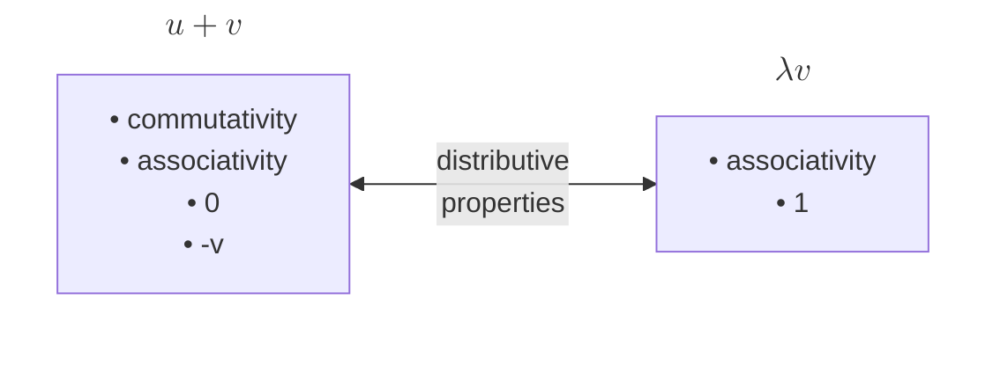

## Vector Space

### Definition

Motivation: properties of addition and scalar multiplication in $ \mathbf{F}^n $

```mermaid
flowchart LR
	subgraph addGroup["$$u + v$$"]
		direction TB
		addSet["&bull; commutativity<br/>&bull; associativity<br/>&bull; 0<br/>&bull; -v"]
	end
	subgraph scalarGroup["$$\lambda v$$"]
		direction TB
		scalarSet["&bull; associativity<br/>&bull; 1"]
	end
	addSet <-->|distributive<br/>properties| scalarSet
	style addGroup fill:transparent,stroke:transparent
	style scalarGroup fill:transparent,stroke:transparent
```

### Examples

* $ \mathbf{F}^S $
* $ \mathcal{p}(\mathbf{R}) $

