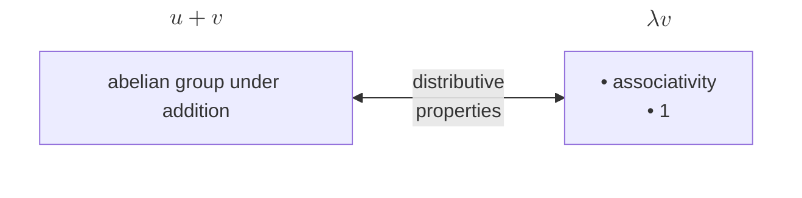

## Vector Space

### Definition

Motivation: properties of addition and scalar multiplication in $ \mathbf{F}^n $

### Examples

* $ \mathbf{F}^S $
* $ \mathcal{P}(\mathbf{F}) $
* $ \mathcal{P}_m(\mathbf{F}) $
* $ \mathcal{L}(V, W) $

### Number of Vectors

The number of vectors equals the number of choices of the coefficient tuple $(a_1, \dots, a_n)$:

$$\#(\text{vectors}) = \lvert \mathbf{F} \rvert ^n$$

Finite fields exist precisely for prime-power sizes $q = p^k$.

|                      | over $\mathbb{R}$ or $\mathbb{C}$ | over $\mathbf{F}_q$ |
| -------------------- | --------------------------------- | ------------------- |
| trivial space        | $1$                               | $1$                 |
| dimension $n \geq 1$ | $\infty$                          | $q^n$               |

## Bases

{: w="600" h="300" }

A list is a basis if it satisfies any two of the following three conditions:

* It is linearly independent
* It spans $V$
* Its length equals $\dim(V)$

## Linear Maps

$ \forall \ \text{basis} \ v_1, \ldots, v_n \in V $ and $ \forall w_1, \ldots, w_n \in W $, $ \exists! T \in \mathcal{L}(V, W) \ \text{s.t.} $

$$ Tv_k = w_k $$

for each $k = 1, \ldots, n$

### Null Spaces and Ranges

{: w="400" h="200" }

Let $ T \in \mathcal{L}(V, W) $

$$ \dim V = \dim \text{null} \, T + \dim \text{range} \, T $$

* $ T $ is injective $ \Leftrightarrow \text{null} \, T = {0} $
* $ T $ is surjective $ \Leftrightarrow \text{range} \, T = W $
* $ T $ is invertible $ \Leftrightarrow $ $ T $ is injective and $ T $ is surjective

Finite-dimensional $V$, $W$:

* $ T $ is injective $ \Rightarrow \dim V \leq \dim W $
* $ T $ is surjective $ \Rightarrow \dim V \geq \dim W $
* $ T $ is invertible $ \Leftrightarrow $ $ T $ is injective $ \Leftrightarrow $ $ T $ is surjective $ \Leftrightarrow \dim V = \dim W $
