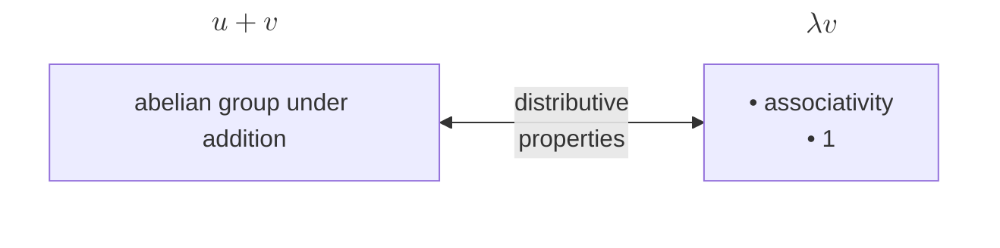

## Vector Space

### Definition

Motivation: properties of addition and scalar multiplication in $ \mathbf{F}^n $

{: .prompt-tip }
> Examples

* $ \mathbf{F}^S $
* $ \mathcal{P}(\mathbf{F}) $
* $ \mathcal{P}_m(\mathbf{F}) $
* $ \mathcal{L}(V, W) $ ($ \dim = (\dim V)(\dim W) $)
* $ \mathbf{F}^{m,n} $ ($ \dim = mn $)
* $ V_1 \times \dots \times V_m $ ($ \dim = \dim V_1 + \dots + \dim V_m $)
* $ V/U $ ($ \dim = \dim V - \dim U $)

### Subspace

{: .prompt-tip }
> Examples

* $ V_1 \cap \dots \cap V_m $
* $ V_1 \cup V_2 $ ($ \Leftrightarrow V1 \subseteq V2 $ or $ V1 \supseteq V2 $)
* $ V_1 + \dots + V_m $ (smallest containing subspace)
* $ U^0 $ ($ \dim = \dim V - \dim U $)

Suppose $V$ is finite-dimensional. $ U $ is a subspace of $ V $:

* $ \dim U \leq \dim V $
* $ \dim U = \dim V \Leftrightarrow U = V $

### Sum

Analogy between sets and vector spaces:

* Cardinality: Dimension
* Union: Sum
* Union of disjoint sets: Direct sum

### Number of Vectors

The number of vectors equals the number of choices of the coefficient tuple $(a_1, \dots, a_n)$:

$$\#(\text{vectors}) = \lvert \mathbf{F} \rvert ^n$$

Finite fields exist precisely for prime-power sizes $q = p^k$.

|                      | over $\mathbb{R}$ or $\mathbb{C}$ | over $\mathbf{F}_q$ |
| -------------------- | --------------------------------- | ------------------- |
| trivial space        | $1$                               | $1$                 |
| dimension $n \geq 1$ | $\infty$                          | $q^n$               |

## Bases

A list is a basis if it satisfies any two of the following three conditions:

* It is linearly independent
* It spans $V$
* Its length equals $ \dim(V) $

A direct-sum decomposition of $ V $ is the same thing as a partition of a basis of $ V $.

A sum is a direct sum iff dimensions add up.

---

## Linear Maps

{: .prompt-tip }
> Examples

* $ T : V \to W $
* $ \Gamma : V_1 \times \dots \times V_m \to V_1 + \dots + V_m $ (Invertible iff $ V_1, \dots, V_m $ is a direct sum)
* Quotient map: $ \pi : V \to V/U $, $ \pi(v) = v + U $
  * $ \tilde{T} ∶ V/(\operatorname{null} T) \to W $, $ \tilde{T}(v + \operatorname{null} T) = Tv $
  * $ \tilde{T} \circ \pi = T $
* $ T \to T' $

A linear map may be prescribed freely on a basis:

$ \forall \ \text{basis} \ v_1, \dots, v_n \in V $ and $ \forall w_1, \dots, w_n \in W $, $ \exists! T \in \mathcal{L}(V, W) \ \text{s.t.} $

$$ Tv_k = w_k $$

for each $k = 1, \dots, n$

{: .prompt-info }
> Extension
>
> $ V $ is finite-dimensional:
>
> $ U $ is a subspace of $ V $, $ S \in \mathcal{L}(U, W) \Rightarrow \exists T \in \mathcal{L}(V, W) \ \text{s.t.} \ T \vert _U = S $
>
> Extend a basis $ u_1,\dots,u_m$ of $U $ to a basis $ u_1,\dots,u_m,\,v_1,\dots,v_n $ of $ V $. Define $ T u_i = S u_i $ and $ T v_j = $ anything in $ W $; extend linearly.

### Algebraic Operations

* $ \mathcal{L}(V, W) $ is a vector space
* Product of linear maps is a [bilinear map](https://en.wikipedia.org/wiki/Bilinear_map)

### Null Spaces and Ranges

{: w="400" h="200" }

{: .prompt-info }
> **Fundamental theorem of linear maps**
>
> Suppose $V$ is finite-dimensional. $ T \in \mathcal{L}(V, W) $:
>
> $$ \dim V = \dim \operatorname{null} T + \dim \operatorname{range} T $$

{: .prompt-tip }
> *Generalization*
>
> Suppose $V$ is finite-dimensional. $ T \in \mathcal{L}(V, W) $, $ U $ is a subspace of $ W $:
>
> $$ \dim \{ v \in V : Tv \in U \} = \dim \operatorname{null} T + \dim (U \cap \operatorname{range} T) $$

{: .prompt-info }
> Injectivity, Surjectivity and Invertibility

| $ T \in \mathcal{L}(V, W) $           | Injective                       | Surjective                     | Invertible (Isomorphic)                    |
| ------------------------------------- | ------------------------------- | ------------------------------ | ------------------------------------------ |
| Definition $ \Leftrightarrow $        | $ \operatorname{null} T = {0} $ | $ \operatorname{range} T = W $ | $ T $ is injective and $ T $ is surjective |
| Preservation $ \Leftrightarrow $      | linear independence             | spanning                       | basis                                      |
| Dimensions (Finite)  $ \Rightarrow $  | $ \dim V \leq \dim W $          | $ \dim V \geq \dim W $         | $ \dim V = \dim W $                        |
| **$\dim V = \dim W$** $ \Rightarrow $ | (all three coincide)            | (all three coincide)           | (all three coincide)                       |

### Product

Suppose $U$ and $V$ are finite-dimensional. $ S \in \mathcal{L}(V, W) $ and $ T \in \mathcal{L}(U, V) $:

* $ \operatorname{null} T \subseteq \operatorname{null} ST $
* $ \operatorname{range} ST \subseteq \operatorname{range} S $

Suppose $ U $ and $ V $ are finite-dimensional. $ S \in \mathcal{L}(V, W) $ and $ T \in \mathcal{L}(U, V) $:

* $ \dim \operatorname{null} ST \leq \dim \operatorname{null} S + \dim \operatorname{null} T $
* $ \dim \operatorname{range} ST \leq \min(\dim \operatorname{range} S + \dim \operatorname{range} T) $

Suppose $ W $ is finite-dimensional. $ T \in \mathcal{L}(V, W) $:

* $ T $ is injective $ \Rightarrow \exists S \in \mathcal{L}(W, V) \ \text{s.t.} \ ST = I $
* $ T $ is surjective $ \Rightarrow \exists S \in \mathcal{L}(W, V) \ \text{s.t.} \ TS = I $

Suppose $ V $ is finite-dimensional and $ S, T \in \mathcal{L}(V, W) $:

* $ ST $ is invertible $\Leftrightarrow$ $ S $ and $ T $ are invertible.

### Factorization

{: .prompt-info }
> Suppose $W$ is finite-dimensional. $ S, T \in \mathcal{L}(V, W) $. $ \operatorname{null} S \subseteq \operatorname{null} T \Leftrightarrow \exists E \in \mathcal{L}(W) \ \text{s.t.} \ T = ES $

{: .prompt-proof }
> We build $E : W \to W$ with $E(Sv) = Tv$ for all $v$.
>
> For $w \in \operatorname{range} S$, write $w = Sv$ and set $Ew := Tv$.
> This is well-defined: if $Sv_1 = Sv_2$, then
> $v_1 - v_2 \in \operatorname{null} S \subseteq \operatorname{null} T$,
> so $Tv_1 = Tv_2$.
> It's linear on $\operatorname{range} S$ since $E(aSv_1 + bSv_2) = E(\bigl(S(av_1+bv_2)\bigr)) = T(av_1+bv_2) = aEw_1 + bEw_2$.
>
> Because $W$ is finite-dimensional,
> $\operatorname{range} S$ has a complement:
>
> $$
> W = \operatorname{range} S \oplus U
> $$
>
> Define $E$ to be $0$ on $U$ and extend linearly. Hence $ES = T$.
> $\blacksquare$

{: .prompt-info }
> Suppose $V$ is finite-dimensional. $ S, T \in \mathcal{L}(V, W) $. $ \operatorname{range} S \subseteq \operatorname{range} T \Leftrightarrow \exists E \in \mathcal{L}(V) \ \text{s.t.} \ S = TE $

{: .prompt-proof }
> Because $V$ is finite-dimensional, pick a basis $v_1, \dots, v_n$ of $V$. For each $j$, the vector $Sv_j$ lies in $\operatorname{range} S \subseteq \operatorname{range} T$, so there exists $u_j \in V$ with
>
> $$T u_j = S v_j.$$
>
> (The preimage $u_j$ lives in $V$ because $T$ starts at $V$ — which is exactly why $E$ ends up being an operator *on* $V$.) Define $E \in \mathcal{L}(V)$ to be the unique linear map with $E v_j = u_j$ for every $j$. Then for each basis vector,
>
> $$(TE)(v_j) = T(E v_j) = T(u_j) = S v_j.$$
>
> So $TE$ and $S$ agree on a basis of $V$, hence $TE = S$.
> $\blacksquare$

| relationship                                              | factorization                               | $E$ acts on                |
| --------------------------------------------------------- | ------------------------------------------- | -------------------------- |
| $\operatorname{range} S \subseteq \operatorname{range} T$ | $S = TE$, $E \in \mathcal{L}(V)$            | domain (one-directional)   |
| $\operatorname{null} S \subseteq \operatorname{null} T$   | $T = ES$, $E \in \mathcal{L}(W)$            | codomain (one-directional) |
| $\operatorname{range} S = \operatorname{range} T$         | $S = TE$, $E \in \mathcal{L}(V)$ invertible | domain (isomorphism)       |
| $\operatorname{null} S = \operatorname{null} T$           | $S = ET$, $E \in \mathcal{L}(W)$ invertible | codomain (isomorphism)     |

### Translate

{: .prompt-info }
> Re-basing
>
> $ x \in v + U \Leftrightarrow x + U = v + U $

{: .prompt-tip }
> Corollary: Two translates of a subspace are equal or disjoint.

Suppose $ T \in \mathcal{L}(V,W) $ and $ c \ in W $:

$ {x \in V : Tx = c} $ is either the empty set or is a translate of $ \operatorname{null} T $

{: .prompt-tip }
> Special case: system of linear equations

### Isomorphism

* $ V/\operatorname{null} T \cong \operatorname{range} T $
* $ \mathcal{L}(V, W) \cong_\tilde{T} \mathbf{F}^{m,n} $
* $ V \cong \mathcal{L}(\mathbf{F}, V) $
* $ V^m \cong \mathcal{L}(\mathbf{F}^m, V) $

---

## Matrices

$ \mathcal{M}(T,(v_1,\dots,v_n),(w_1,\dots,w_m)) \in \mathbf{F}^{m,n} $ is the matrix *representation* of $ T $ with respect to the chosen bases.

$$ Tv_k = \sum_{j=1}^m {A_{j,k}w_j} $$

{: .prompt-tip }
> $ T \in \mathcal{L}(\mathbf{F}^n, \mathbf{F}^m) $, $ \mathcal{M}(T,(e_1, \dots, e_n), (e_1, \dots, e_m))_{\cdot,k} = Te_k $

{: .prompt-info }
> Column of matrix product equals matrix times column

{: .prompt-info }
> Linear combination of columns

$ \dim \operatorname{range} S = \text{rank} \, \mathcal{M}(T) $

{: .prompt-info }
> Column–row factorization

$ C $ is a *basis* of the column space.

{: .prompt-tip }
> $ A \mapsto A^T $ is a linear map

{: .prompt-info }
> Change-of-basis

$$ \mathcal{M}(I,(u_1,\dots,u_n),(v_1,\dots,v_n))\mathcal{M}(I,(v_1,\dots,v_n),(u_1,\dots,u_n)) = I $$

$ T \in \mathcal{L}(V) $, $ A = \mathcal{M}(T,(u_1,\dots,u_n)), B = \mathcal{M}(T,(v_1,\dots,v_n)), C = \mathcal{M}(I,(u_1,\dots,u_n),(v_1,\dots,v_n))$:

$$ A = C^{-1}BC $$

## Dual Space and Dual Map

{: w="600" h="300" }

* $ T $ is injective $ \Leftrightarrow $ $ T' $ is surjective
* $ T $ is surjective $ \Leftrightarrow $ $ T' $ is injective

* $ \operatorname{null} T' = (\operatorname{range} T)^0 $
* $ \operatorname{range} T' = (\operatorname{null} T)^0 $

* $ \dim \operatorname{null} T' = \dim \operatorname{null} T + \dim W - \dim V $
* $ \dim \operatorname{range} T' = \dim \operatorname{range} T $
