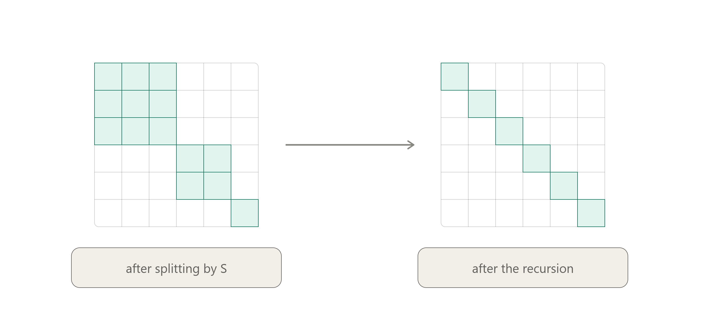

## Invariant Subspaces

{: .prompt-info }
> Suppose $ T \in \mathcal{L}(V) $ and $ U $ is a subspace of $ V $ invariant under $ T $. Then $ U $ is invariant under $ p(T) $ for every polynomial $ p \in \mathcal{P}(\mathbf{F}) $.

{: .prompt-info }
> Every subspace of an eigenspace is invariant.

{: .prompt-info }
>  Suppose that $ V $ is finite-dimensional and $ k \in \\{ 1, \dots \dim V - 1 \\}$. Suppose $ T \in \mathcal{L}(V) $ is such that every subspace of $ V $ of dimension $ k $ is invariant under $ T $. Then
>
> $$ \bigcap \{U : \dim U = k,\ v \in U\} = \operatorname{span}(v). $$

{: .prompt-proof }
> The $\supseteq$ direction is trivial ($v$ is in each such $U$). For $\subseteq$, I show any $w \notin \operatorname{span}(v)$ can be *excluded* by some $k$-subspace through $v$ — so $w$ can't be in the intersection.
>
> Suppose $w \notin \operatorname{span}(v)$. Then $v, w$ are independent, so extend them to a basis
>
> $$v,\ w,\ x_3,\ \dots,\ x_n \qquad (n = \dim V).$$
>
> Now set
>
> $$U = \operatorname{span}(v,\ x_3,\ x_4,\ \dots,\ x_{k+1}) = \operatorname{span}(v) + \operatorname{span}(x_3,\dots,x_{k+1}).$$
>
> That's $v$ together with $k-1$ of the $x_i$'s, so $\dim U = k$, and $v \in U$. But $w \notin U$: the vectors $v, x_3, \dots, x_{k+1}$ are part of a basis that also includes $w$, so $w$ is independent of them and hence not in their span. This $U$ contains $v$, has dimension $k$, and misses $w$. $\blacksquare$

{: .prompt-tip }
> "Every $k$-dimensional subspace is invariant" collapses to "every line is invariant" — i.e. all the way down to $k=1$ — because a line is recoverable as the intersection of the $k$-subspaces sitting above it.

## Eigen-*

{: .prompt-info }
> Suppose $ T \in \mathcal{L}(V) $, then
>
> $ E(0, T) \subseteq \operatorname{null} T $,
>
> $ E(\lambda, T) \subseteq \operatorname{range} T $, where $ \lambda \ne 0 $.

{: .prompt-info }
> Suppose $ T \in \mathcal{L}(V) $. Then every list of eigenvectors of $ T $ corresponding to distinct eigenvalues of $ T $ is _linearly independent_.

{: .prompt-tip }
> Suppose $ V $ is finite-dimensional and $ v_1, \dots, v_m \in V $.
>
> $ v_1, \dots, v_m \in V $ is linearly independent $ \iff \exists T \in \mathcal{L}(V) $ such that $ v_1, \dots, v_m \in V $ are eigenvectors of $ T $ corresponding to distinct eigenvalues.

{: .prompt-tip }
> Tight upper bounds of the number of _distinct_ eigenvalues:
>
> * $ \dim V $
> * $ 1 + \dim \operatorname{range} T $

{: .prompt-proof }
> $\operatorname{range} T$ contains $m$ linearly independent vectors, which forces
>
> $$m \le \dim \operatorname{range} T.$$
>
> The eigenvalues of $T$ are these $m$ nonzero ones, *plus possibly* $0$. Since $0$ is a single value, it adds at most $1$ to the count of distinct eigenvalues:
>
> $$\#\{\text{distinct eigenvalues}\} \le m + 1 \le \dim \operatorname{range} T + 1. \qquad \blacksquare$$

{: .prompt-tip }
> Let $r = \dim \operatorname{range} T$ and $n = \dim V$. Rank-nullity: $\dim \operatorname{null} T = n - r$.
>
> - If $0$ is **not** an eigenvalue: $T$ injective, $r = n$, so $1 + r = n + 1 > n = \dim V$. The range bound is the *weaker* (larger) one here — but it's still valid, just not as good as $\dim V$.
> - If $0$ **is** an eigenvalue: $r \le n - 1$, so $1 + r \le n = \dim V$. Now the range bound is the *stronger* (smaller, better) one.
>
> So the range bound $1 + r$ is the better bound exactly when $0$ is an eigenvalue — which is the whole point of the problem: it *improves* on $\dim V$ precisely in the non-injective case, by using the range to corral the nonzero eigenvalues and spending only "+1" on zero.

{: .prompt-info }
> For any invertible $T$ with minimal polynomial $p$ of degree $m$:
>
> $$p_{T^{-1}}(z) = \frac{z^m\, p(1/z)}{p(0)}.$$

{: .prompt-tip }
> $Tv = \lambda v \iff T^{-1}v = \lambda^{-1}v$
>
> (a) The eigenvalues of $T^{-1}$ are exactly the reciprocals of those of $T$.
>
> (b) $ E(\lambda, T) = E(\frac{1}{\lambda}, T^{-1}) $.

{: .prompt-info }
> Suppose $ T \in \mathcal{L}(V) $ is such that every nonzero vector in $ V $ is an eigenvector of $ T $. Then $ T $ is a scalar multiple of the identity operator.

{: .prompt-info }
> Suppose $V$ is finite-dimensional, $ T \in \mathcal{L}(V) $, and $ \lambda \in \mathbf{F} $.
>
> $\lambda$ is an eigenvalue of $T \iff \lambda$ is an eigenvalue of the dual operator $ T' \in \mathcal{L}(V'). $

{: .prompt-info }
> Suppose $ \mathbf{F} = \mathbb{R} $, $ T \in \mathcal{L}(V) $, and $ \lambda \in \mathbb{R} $.
>
> $\lambda$ is an eigenvalue of $T \iff \lambda$ is an eigenvalue of the complexification $ T_{\mathbb{C}}. $

{: .prompt-info }
> Suppose $ \mathbf{F} = \mathbb{R} $, $ T \in \mathcal{L}(V) $, and $ \lambda \in \mathbb{C} $.
>
> $\lambda$ is an eigenvalue of the complexification $T_{\mathbb{C}} \iff \bar{\lambda} $ is an eigenvalue of $ T_{\mathbb{C}} $.

{: .prompt-proof }
> Recall $V_{\mathbb{C}} = \\{ u + iv : u, v \in V \\}$ with $T_{\mathbb{C}}(u+iv) = Tu + iTv$. Define **conjugation** $C : V_{\mathbb{C}} \to V_{\mathbb{C}}$ by
>
> $$C(u + iv) = u - iv.$$
>
> Two properties, both routine to check:
>
> - $C$ is a **bijection**, in fact an involution: $C\big(C(u+iv)\big) = C(u - iv) = u + iv$, so $C^{-1} = C$. In particular $C$ sends nonzero vectors to nonzero vectors.
> - $C$ is **conjugate-linear**: $C(\alpha w) = \bar\alpha\, C(w)$ for $\alpha \in \mathbb{C}$. (Direct from the scalar-multiplication rule on $V_{\mathbb{C}}$.)
>
> **Claim:** $T_{\mathbb{C}} \circ C = C \circ T_{\mathbb{C}}$, i.e. $T_{\mathbb{C}}$ commutes with conjugation.
>
> $$T_{\mathbb{C}}\big(C(u+iv)\big) = T_{\mathbb{C}}(u - iv) = Tu - iTv = C(Tu + iTv) = C\big(T_{\mathbb{C}}(u+iv)\big).\ \checkmark$$
>
> Suppose $\lambda$ is an eigenvalue of $T_{\mathbb{C}}$: there is $w \neq 0$ in $V_{\mathbb{C}}$ with
>
> $$T_{\mathbb{C}}\,w = \lambda w.$$
>
> Apply $C$ to both sides. On the right, conjugate-linearity gives $C(\lambda w) = \bar\lambda\, Cw$. On the left, the commuting relation gives $C(T_{\mathbb{C}} w) = T_{\mathbb{C}}(Cw)$. Hence
>
> $$T_{\mathbb{C}}(Cw) = \bar\lambda\,(Cw).$$
>
> Since $C$ is a bijection and $w \neq 0$, we have $Cw \neq 0$. So $Cw$ is an eigenvector of $T_{\mathbb{C}}$ with eigenvalue $\bar\lambda$ — meaning **$\bar\lambda$ is an eigenvalue of $T_{\mathbb{C}}$.**
>
> That proves the forward direction. The converse needs no new work: the statement is symmetric under $\lambda \leftrightarrow \bar\lambda$, since $\overline{\bar\lambda} = \lambda$. Concretely, apply what we just proved to $\bar\lambda$ in place of $\lambda$: if $\bar\lambda$ is an eigenvalue, so is $\overline{\bar\lambda} = \lambda$. $\blacksquare$

{: .prompt-tip }
> Suppose $ \mathbf{F} = \mathbb{R} $, $ T \in \mathcal{L}(V) $, and $ \lambda \in \mathbb{C} $.
>
> The eigenspaces are swapped by conjugation:
>
> $$C\big(E(\lambda, T_{\mathbb{C}})\big) = E(\bar\lambda, T_{\mathbb{C}}).$$

{: .prompt-info }
> Suppose $ T \in \mathcal{L}(V) $ and $ \lambda $ is an eigenvalue of $ T $, then
>
> $$ \left\lvert \lambda \right\rvert \le n \max\{\left\lvert \mathcal{M}(T, (v_1,\dots,v_n))_{j,k} \right\rvert : 1 \le j, k \le n \}. $$

{: .prompt-info }
> Sum of eigenspaces is a direct sum.

{: .prompt-info }
> In an upper-triangular matrix,
>
> $$\{\text{distinct diagonal entries}\} = \{\text{zeros of min poly}\} = \{\text{eigenvalues}\}.$$
>
> $$1 \le (\text{min-poly exponent of } \lambda) \le (\text{times } \lambda \text{ appears on the diagonal}) = \dim E{\lambda, T}. $$

| $T \in \mathcal{L}(V)$ | Basis                                                                          | Subspaces                                                                                    | Dimensions                            | Minimal polynomial ($ m = \deg p \le \dim V $)                                                                             | Nullspace and range                                                                     |
| ---------------------- | ------------------------------------------------------------------------------ | -------------------------------------------------------------------------------------------- | ------------------------------------- | -------------------------------------------------------------------------------------------------------------------------- | --------------------------------------------------------------------------------------- |
| Upper-triangularizable | $ Tv_k \in \operatorname{span}(v_1, \dots, v_k) $ for each $ k = 1, \dots, n $ | $ \operatorname{span}(v_1, \dots, v_k) $ is invariant under $T$ for each $ k = 1, \dots, n $ |                                       | $ (z - \lambda_1)\dots(z - \lambda_m) $ for some $ \lambda_1, \dots, \lambda_m \in \mathbf{F} $ (repetitions allowed)      |                                                                                         |
| Lower-triangularizable | $ Tv_k \in \operatorname{span}(v_k, \dots, v_n) $ for each $ k = 1, \dots, n $ | $ \operatorname{span}(v_k, \dots, v_n) $ is invariant under $T$ for each $ k = 1, \dots, n $ |                                       | $ (z - \lambda_1)\dots(z - \lambda_m) $ for some $ \lambda_1, \dots, \lambda_m \in \mathbf{F} $ (repetitions allowed)      |                                                                                         |
| Diagonalizable         | $\exists$ a basis of $V$ consisting of eigenvectors of $T$                     | $V = E(\lambda_1,T)\oplus\cdots\oplus E(\lambda_m,T)$                                        | $\sum_k \dim E(\lambda_k,T) = \dim V$ | $ (z - \lambda_1)\dots(z - \lambda_m) $ for some list of _distinct_ numbers $ \lambda_1, \dots, \lambda_m \in \mathbf{F} $ | $ V = \operatorname{null} (T - \lambda I) \oplus \operatorname{range} (T - \lambda I) $ |

{: .prompt-tip }
> Diagonalizable means the eigenspaces are *as big as they can be* — big enough to fill $V$. Each column says "fill $V$" in a different dialect: enough eigenvectors for a basis, eigenspaces summing directly to $V$, dimensions adding to $\dim V$, and — the min poly one — no eigenvalue needing a repeated factor to be annihilated (a repeat is exactly the symptom of an eigenspace that came up short, like the $(0,1)$ vector that $(T-5I)$ couldn't kill in one step).

{: .prompt-proof }
> Let $n = \dim V$.
>
> *($\Rightarrow$)* If $T$ is diagonalizable, a basis of eigenvectors of $T$ is also a basis of eigenvectors of $T - \lambda I$ (eigenvalue $\lambda_j - \lambda$), so $T - \lambda I$ is diagonalizable.
>
> *($\Leftarrow$)* Assume $V = \operatorname{null}(T-\lambda I) \oplus \operatorname{range}(T-\lambda I)$ for every $\lambda \in \mathbf{C}$. Fix $\lambda$ and write $S = T - \lambda I$.
>
> **Step 1: $\operatorname{null} S = \operatorname{null} S^2$.** The inclusion $\subseteq$ always holds. Conversely, if $v \in \operatorname{null} S^2$ then $S(Sv) = 0$, so $Sv \in \operatorname{null} S$; also $Sv \in \operatorname{range} S$. Directness of the sum forces $\operatorname{null} S \cap \operatorname{range} S = \{0\}$, so $Sv = 0$.
>
> **Step 2: $G(\lambda, T) = E(\lambda, T)$.** By the result on equality in the sequence of null spaces, Step 1 with $m = 1$ gives $\operatorname{null} S = \operatorname{null} S^k$ for every $k \geq 1$. Taking $k = n$ and using the definition $G(\lambda,T) = \operatorname{null}(T-\lambda I)^{n}$:
>
> $$G(\lambda, T) = \operatorname{null} S^{n} = \operatorname{null} S = E(\lambda, T).$$
>
> **Step 3: conclude.** Let $\lambda_1, \dots, \lambda_m$ be the distinct eigenvalues of $T$ (there is at least one, as $V \neq \{0\}$ is complex; if $V = \{0\}$ the claim is trivial). The generalized eigenspace decomposition says
>
> $$V = G(\lambda_1, T) \oplus \cdots \oplus G(\lambda_m, T).$$
>
> By Step 2 each summand equals $E(\lambda_j, T)$, so
>
> $$V = E(\lambda_1, T) \oplus \cdots \oplus E(\lambda_m, T),$$
>
> which is one of the standard equivalent conditions for diagonalizability. Hence $T$ is diagonalizable. $\blacksquare$

{: .prompt-info }
> *Dense* for every $T \in \mathcal{L}(V)$ and every $\varepsilon > 0$ there is a diagonalizable $D$ with $\|T - D\| < \varepsilon$.

{: .prompt-info }
> Over $\mathbf{C}$, the diagonalizable operators are dense in $\mathcal{L}(V)$.

{: .prompt-proof }
> Let $T \in \mathcal{L}(V)$, $n = \dim V$. Since $\mathbf{F} = \mathbf{C}$, there is a basis $v_1,\dots,v_n$ with respect to which $\mathcal{M}(T)$ is upper triangular, with diagonal entries $\lambda_1,\dots,\lambda_n$. Given $\varepsilon > 0$, choose $\varepsilon_1,\dots,\varepsilon_n \in \mathbf{C}$ with $|\varepsilon_j| < \varepsilon$ such that $\lambda_1 + \varepsilon_1, \dots, \lambda_n + \varepsilon_n$ are pairwise distinct — always possible, since each $\varepsilon_j$ needs only to avoid finitely many values, and any disc is infinite.
>
> Define $D \in \mathcal{L}(V)$ by $Dv_j = \varepsilon_j v_j$. Then $\mathcal{M}(T + D)$ is upper triangular with the distinct entries $\lambda_j + \varepsilon_j$ on the diagonal. The diagonal of a triangular matrix lists the eigenvalues, so $T + D$ has $n$ distinct eigenvalues in a space of dimension $n$, hence is diagonalizable. And $D$ is small: in the norm making $v_1,\dots,v_n$ orthonormal, $\|D\| = \max_j |\varepsilon_j| < \varepsilon$. $\blacksquare$

## Nilpotent

{: .prompt-info }
> Let $W$ be a finite-dimensional vector space, let $R \in \mathcal{L}(W)$ be nilpotent, and let $c \in \mathbb{F}$ with $c \neq 0$. Then $cI + R$ is invertible.

{: .prompt-proof }
> **Lemma** *Let $A \in \mathcal{L}(W)$, $c \in \mathbb{F}$, and set $B = cI + A$. If $\mu$ is an eigenvalue of $B$, then $\mu - c$ is an eigenvalue of $A$.*
>
> *Proof.* Let $v \neq 0$ satisfy $Bv = \mu v$. Then
>
> $$Av = (B - cI)v = Bv - cv = \mu v - cv = (\mu - c)v ,$$
>
> and $v \neq 0$, so $\mu - c$ is an eigenvalue of $A$. $\blacksquare$
>
> **Proof of the Theorem.**
>
> If $W = \{0\}$ the statement is trivial, so assume $W \neq \{0\}$.
>
> Now we prove $0$ is not an eigenvalue of $cI + R$. Suppose toward a contradiction that it is. Applying the Lemma with $A = R$, $B = cI + R$, and $\mu = 0$, we conclude that $0 - c = -c$ is an eigenvalue of $R$. The only eigenvalue of $R$ is $0$, hence $-c = 0$, i.e. $c = 0$ — contradicting the hypothesis $c \neq 0$.
>
> Therefore, $cI + R$ is injective and thus invertible. $\blacksquare$

## Eigenspace

{: .prompt-info }
> An eigenvalue $\lambda$ of $T$ is called **defective** when its **geometric multiplicity is strictly less than its algebraic multiplicity**:
>
> $$\dim E(\lambda, T) \;<\; \dim G(\lambda, T).$$

{: .prompt-tip }
> $\lambda$ is defective exactly when
>
> $$\operatorname{null}(T - \lambda I) \subsetneq \operatorname{null}(T - \lambda I)^2,$$
>
> i.e. there exists a *generalized* eigenvector that is not an honest eigenvector. In Jordan-form > terms, $\lambda$ is defective iff at least one Jordan block for $\lambda$ has size $\geq 2$.
>
> An operator with no defective eigenvalues is diagonalizable, and vice versa. So "defective" is precisely the local obstruction to diagonalizability — it flags the eigenvalues where the nilpotent part on that block is nonzero.

{: .prompt-info }
> Suppose $ \mathbf{F} = \mathbb{C}$, $ T \in \mathcal{L}(V) $, $ p \in \mathcal{P}(\mathbb{C}) $ is a nonconstant polynomial, and $ \alpha \in \mathbb{C} $, then
>
> (a) $G(\alpha,\, p(T)) \;=\; \bigoplus_{\lambda:\, p(\lambda) = \alpha} G(\lambda,\, T).$
>
> (b) $E(\alpha, p(T)) \;\supseteq\; \bigoplus_{\lambda:\,p(\lambda)=\alpha} E(\lambda, T)$, with equality iff $p'(\lambda) \neq 0$ for every defective $\lambda$ in that fiber.

{: .prompt-proof }
> (a) Each $G(\lambda, T)$ is $T$-invariant, hence $p(T)$-invariant. On $G(\lambda, T)$, write $T = \lambda I + N$ where $N$ is nilpotent. Since $\lambda I$ and $N$ commute, the algebraic Taylor expansion of $p$ around $\lambda$ holds:
>
> $$p(T)\big|_{G(\lambda,T)} \;=\; \sum_{k=0}^{\deg p} \frac{p^{(k)}(\lambda)}{k!}\, N^k \;=\; p(\lambda)\,I \;+\; \underbrace{\Big(p'(\lambda)N + \tfrac{p''(\lambda)}{2}N^2 + \cdots\Big)}_{=:\,M}.$$
>
> The remainder $M$ is a polynomial in $N$ with **zero constant term**, so it's nilpotent. That means $p(T)$ acts on $G(\lambda, T)$ as $p(\lambda)I + (\text{nilpotent})$ — its *only* eigenvalue there is $p(\lambda)$, and the whole block sits inside $G(p(\lambda), p(T))$. Summing over all $\lambda$ with $p(\lambda) = \alpha$ and counting dimensions (both sides decompose $V$) upgrades the inclusion to equality.
>
> (b) Now zoom in from $G$ to $E$ inside a single block. The ordinary eigenspace of $p(T)$ for $\alpha = p(\lambda)$, intersected with $G(\lambda, T)$, is $\operatorname{null}(M)$, whereas $E(\lambda, T) = \operatorname{null}(N)$. Factor $M = N \cdot Q$ with
>
> $$Q = p'(\lambda) I + \tfrac{p''(\lambda)}{2}N + \cdots.$$
>
> Two cases:
>
> - **If $p'(\lambda) \neq 0$**, then $Q$ is (scalar) + (nilpotent), hence invertible, so $\operatorname{null}(M) = \operatorname{null}(N)$. The eigenspace matches exactly.
> - **If $p'(\lambda) = 0$**, then $M$ starts at $N^2$ or higher, so $\operatorname{null}(M) \supseteq \operatorname{null}(N^2) \supsetneq \operatorname{null}(N)$ — provided $N$ has a Jordan block of size $\geq 2$.
>
> So the precise condition for strict growth of the ordinary eigenspace is: **$\lambda$ is a critical point of $p$ (i.e. $p'(\lambda)=0$) *and* $\lambda$ is a defective eigenvalue of $T$ (has a nontrivial Jordan block).**

## Commuting Operators

{: .prompt-info }
> Suppose $ S,T \in \mathcal{L}(V) $ are such that $ ST = TS $. Suppose $ p \in \mathcal{P}(\mathbf{F}) $. Then
>
> $ \operatorname{null} p(S) $ and $ \operatorname{range} p(S) $ are invariant under $ T $.

{: .prompt-tip }
> Special cases:
>
> * $ p(z) = z - \lambda $, then $ E(\lambda, S) $ is invariant under $ T $.
> * $ p(z) = (z - \lambda)^{\dim V} $, then $ G(\lambda, S) $ is invariant under $ T $.

{: .prompt-info }
> *simultaneous diagonalizability $\iff$ commutativity*
>
> Suppose $ \mathcal{E} $ is a subset of $ \mathcal{L}(V) $ and every element of $ \mathcal{E} $ is diagonalizable.
>
> There exists a basis of $ V $ with respect to which every element of $ \mathcal{E} $ has a diagonal matrix $\iff$ every pair of elements of $ \mathcal{E} $ commutes.

{: .prompt-proof }
> ($\Leftarrow$) Suppose every pair in $\mathcal{E}$ commutes. Induct on $n = \dim V$.
>
> **Case 1: every $T \in \mathcal{E}$ is a scalar multiple of $I$.** Then every basis of $V$ works. (This covers $n = 1$, so the base case is free.)
>
> **Case 2: some $S \in \mathcal{E}$ is not a scalar multiple of $I$.** Since $S$ is diagonalizable with eigenvalues $\lambda_1,\dots,\lambda_m$,
>
> $$V = E(\lambda_1,S) \oplus \cdots \oplus E(\lambda_m,S),$$
>
> and $m \geq 2$ (otherwise $S = \lambda_1 I$). So each $E(\lambda_j, S)$ is a subspace of dimension strictly less than $n$.
>
> Fix $j$ and write $W = E(\lambda_j, S)$. $W$ is invariant under every $T \in \mathcal{E}$ and each $\left. T \right\rvert_W$ is diagonalizable, so the restricted family commutes: for $T, R \in \mathcal{E}$ and $w \in W$, invariance gives $(\left. T \right\rvert_W)(\left. R \right\rvert_W)w = T(Rw) = (TR)w = (RT)w = (\left. R \right\rvert_W)(\left. T \right\rvert_W)w$.
>
> So $\mathcal{E}_j = \{\left. T\right\rvert_W : T \in \mathcal{E}\}$ is a commuting family of diagonalizable operators on a space of dimension $< n$. By the induction hypothesis there is a basis $\mathcal{B}_j$ of $W$ making *every* element of $\mathcal{E}_j$ diagonal — that is, every vector of $\mathcal{B}_j$ is an eigenvector of $T$ for every $T \in \mathcal{E}$ simultaneously.
>
> Now let $\mathcal{B} = \mathcal{B}_1 \cup \cdots \cup \mathcal{B}_m$. Because $V$ is the direct sum of the $E(\lambda_j,S)$, this is a basis of $V$, and each of its vectors is an eigenvector of every $T \in \mathcal{E}$. So every element of $\mathcal{E}$ has a diagonal matrix with respect to $\mathcal{B}$. $\blacksquare$

{: .prompt-info }
> Suppose $V$ is a finite-dimensional nonzero *complex* vector space. Suppose that $ \mathcal{E} \subset \mathcal{L}(V) $ is such that $S$ and $T$ commute for all $S,T \in \mathcal{E}$.
>
> (a) There is a vector in $V$ that is an eigenvector for every element of $\mathcal{E}$.
>
> (b) There is a basis of $V$ with respect to which every element of $\mathcal{E}$ has an upper-triangular matrix.

{: .prompt-info }
> Suppose $\mathbf{F} = \mathbb{C}$ and $V = \bigoplus_{\lambda_k} G(\lambda_k, T)$.
>
> $ST = TS \iff G(\lambda_k,T) $ is invariant under $S$ **and** $\left. S \right\rvert_{G(\lambda_k,T)}$ commutes with $\left. (T-\lambda_k I) \right\rvert_{G(\lambda_k,T)}$ for each $ k = 1, \cdots, m $.

{: .prompt-info }
> Suppose $T \in \mathcal{L}(V) $, $ p \in \mathcal{P}(\mathbf{F}) $.
>
> $p(T)$ and $T$ commute $\iff$ the minimal and characteristic polynomials coincide.

{: .prompt-info }
> Suppose a nilpotent operator $N \in \mathcal{L}(V) $, $ p \in \mathcal{P}(\mathbf{F}) $.
>
> $p(N)$ and $N$ commute $\iff$ N $ has a single Jordan block.

{: .prompt-info }
> $\mathcal{C}(T) = \\{S \in \mathcal{L}(V) : ST = TS\\}$ and $\mathcal{P}(T) = \\{p(T) : p \in \mathcal{P}(\mathbf{F})\\}$
>
> (a) $\mathcal{C}(T) = \mathcal{P}(T)$ $\iff$ the minimal and characteristic polynomials of $T$ coincide.
>
> (b) For $N$ nilpotent, $\mathcal{C}(N) = \mathcal{P}(N)$ $\iff$ $N$ has a single Jordan block.

{: .prompt-proof }
> ($\Leftarrow$) If $\deg(\text{min poly}) = n$, then $V$ is cyclic: there is $v$ with $v, Tv, \dots, T^{n-1}v$ a basis. Given $S \in \mathcal{C}(T)$, write $Sv = p(T)v$ for some polynomial $p$ (possible since that list spans $V$). Then for each $j$,
$$S(T^j v) = T^j(Sv) = T^j p(T) v = p(T)(T^j v),$$
so $S$ and $p(T)$ agree on a basis, hence $S = p(T)$.
>
> ($\Rightarrow$) Use $\dim \mathcal{P}(T) = \deg(\text{min poly})$ together with the standard fact $\dim \mathcal{C}(T) \geq n$, with equality exactly when $T$ is cyclic. If $\mathcal{C}(T) = \mathcal{P}(T)$ then $\deg(\text{min poly}) = \dim\mathcal{C}(T) \geq n$, and since the minimal polynomial always divides the characteristic one, degree $n$ forces them equal.

{: .prompt-proof }
An operator with $\text{min} = \text{char}$ is called **nonderogatory** or **cyclic**.
