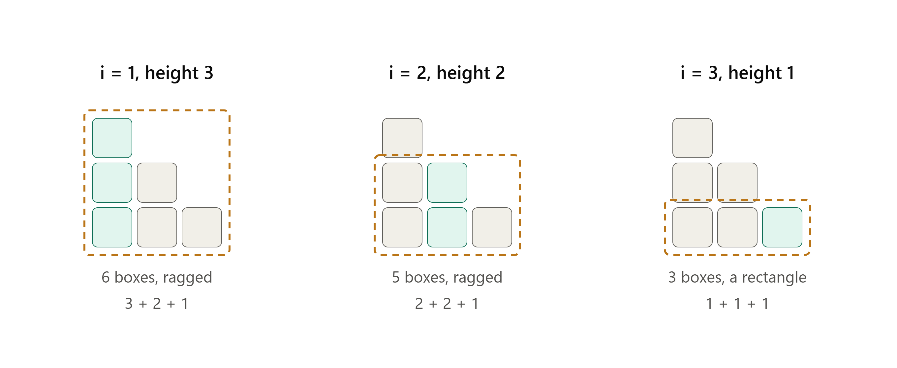

This post continues [Nilpotent Operators](). It has two halves. The first collects what can be said
about commuting operators in general, and ends with a reduction: for a complex vector space,
the whole question collapses to the case of a **nilpotent** operator. The second half answers
that case completely, using the Young diagram from [Nilpotent Operators]().

## Notation

{: .prompt-info }
> For $T \in \mathcal{L}(V)$, write
>
> $$\mathcal{C}(T) = \{S \in \mathcal{L}(V) : ST = TS\}, \qquad \mathcal{P}(T) = \{q(T) : q \in \mathcal{P}(\mathbf{F})\}$$
>
> for the **commutant** of $T$ and the operators expressible as **polynomials** in $T$. Both are subspaces of $\mathcal{L}(V)$, and in fact subalgebras: they are closed under composition.

{: .prompt-warning }
> $\mathcal{P}(T) \subseteq \mathcal{C}(T)$ always, since $T$ commutes with $I$ and with itself, hence with every polynomial in itself. That direction is free, and it is not the interesting one. The question this post answers for nilpotent operators is the **converse**: when is every operator commuting with $T$ a polynomial in $T$?

{: .prompt-tip }
> *Notation recall.* A nilpotent $N \in \mathcal{L}(V)$ splits $V$ into Jordan chains with tops $v_1,\dots,v_k$ and lengths $m_1 \ge \dots \ge m_k$, forming a partition $\mu$ of $\dim V$ drawn as a bottom-aligned array of boxes with the chains as columns. Its conjugate $\mu'$ has $\mu'_j = \\#\\{i : m_i \ge j\\}$, the size of level $j$, and $d_j = \dim\operatorname{null}N^j = \mu'_1 + \dots + \mu'_j$. Throughout, $p = m_1$ is the index of nilpotency and $n = \dim V$.

## Commuting Operators in General

Nothing in this section assumes nilpotency.

{: .prompt-info }
> Suppose $ S,T \in \mathcal{L}(V) $ are such that $ ST = TS $. Suppose $ q \in \mathcal{P}(\mathbf{F}) $. Then
>
> $ \operatorname{null} q(S) $ and $ \operatorname{range} q(S) $ are invariant under $ T $.

{: .prompt-tip }
> Special cases:
>
> * $ q(z) = z - \lambda $, then $ E(\lambda, S) $ is invariant under $ T $.
> * $ q(z) = (z - \lambda)^{\dim V} $, then $ G(\lambda, S) $ is invariant under $ T $.

{: .prompt-info }
> *simultaneous diagonalizability $\iff$ commutativity*
>
> Suppose $ \mathcal{E} $ is a subset of $ \mathcal{L}(V) $ and every element of $ \mathcal{E} $ is diagonalizable.
>
> There exists a basis of $ V $ with respect to which every element of $ \mathcal{E} $ has a diagonal matrix $\iff$ every pair of elements of $ \mathcal{E} $ commutes.

{: .prompt-proof }
> ($\Leftarrow$) Suppose every pair in $\mathcal{E}$ commutes. Induct on $n = \dim V$.
>
> **Case 1: every $T \in \mathcal{E}$ is a scalar multiple of $I$.** Then every basis of $V$ works. (This covers $n = 1$, so the base case is free.)
>
> **Case 2: some $S \in \mathcal{E}$ is not a scalar multiple of $I$.** Since $S$ is diagonalizable with eigenvalues $\lambda_1,\dots,\lambda_m$,
>
> $$V = E(\lambda_1,S) \oplus \dots \oplus E(\lambda_m,S),$$
>
> and $m \geq 2$ (otherwise $S = \lambda_1 I$). So each $E(\lambda_j, S)$ is a subspace of dimension strictly less than $n$.
>
> Fix $j$ and write $W = E(\lambda_j, S)$. $W$ is invariant under every $T \in \mathcal{E}$ and each $\left. T \right\rvert_W$ is diagonalizable, so the restricted family commutes: for $T, R \in \mathcal{E}$ and $w \in W$, invariance gives $(\left. T \right\rvert_W)(\left. R \right\rvert_W)w = T(Rw) = (TR)w = (RT)w = (\left. R \right\rvert_W)(\left. T \right\rvert_W)w$.
>
> So $\mathcal{E}_j = \{\left. T\right\rvert_W : T \in \mathcal{E}\}$ is a commuting family of diagonalizable operators on a space of dimension $< n$. By the induction hypothesis there is a basis $\mathcal{B}_j$ of $W$ making *every* element of $\mathcal{E}_j$ diagonal — that is, every vector of $\mathcal{B}_j$ is an eigenvector of $T$ for every $T \in \mathcal{E}$ simultaneously.
>
> Now let $\mathcal{B} = \mathcal{B}_1 \cup \dots \cup \mathcal{B}_m$. Because $V$ is the direct sum of the $E(\lambda_j,S)$, this is a basis of $V$, and each of its vectors is an eigenvector of every $T \in \mathcal{E}$. So every element of $\mathcal{E}$ has a diagonal matrix with respect to $\mathcal{B}$. $\blacksquare$

{: .prompt-info }
> Suppose $V$ is a finite-dimensional nonzero *complex* vector space. Suppose that $ \mathcal{E} \subset \mathcal{L}(V) $ is such that $S$ and $T$ commute for all $S,T \in \mathcal{E}$.
>
> (a) There is a vector in $V$ that is an eigenvector for every element of $\mathcal{E}$.
>
> (b) There is a basis of $V$ with respect to which every element of $\mathcal{E}$ has an upper-triangular matrix.

### Reduction to the Nilpotent Case

The results above describe commuting *families*. To describe the commutant of a single
operator, the first move is to break $V$ into generalized eigenspaces, on each of which the
operator is a scalar plus a nilpotent.

{: .prompt-info }
> Suppose $\mathbf{F} = \mathbb{C}$ and $V = \bigoplus_{\lambda_k} G(\lambda_k, T)$.
>
> $ST = TS \iff G(\lambda_k,T) $ is invariant under $S$ **and** $\left. S \right\rvert_{G(\lambda_k,T)}$ commutes with $\left. (T-\lambda_k I) \right\rvert_{G(\lambda_k,T)}$ for each $ k = 1, \dots, m $.

{: .prompt-tip }
> This is the reduction that governs the rest of the post. On $G(\lambda_k, T)$ the operator $\left. T \right\rvert_{G(\lambda_k,T)}$ is $\lambda_k I + N_k$ with $N_k$ nilpotent, and adding a scalar multiple of $I$ changes nothing about what commutes with it:
>
> $$\mathcal{C}(\lambda I + N) = \mathcal{C}(N).$$
>
> So computing $\mathcal{C}(T)$ means computing $\mathcal{C}(N_k)$ for each block and assembling. **Everything below therefore takes $N$ nilpotent, with no loss.**

## Parametrization

Suppose $SN = NS$. Then $SN^j = N^jS$ for all $j$, so for every basis vector

$$S(N^j v_i) = N^j (S v_i).$$

The left side is $S$ on an arbitrary *basis* vector; the right side only involves the $k$ vectors $Sv_1,\dots,Sv_k$. So a commuting $S$ is pinned down by its values on the $k$ tops.

Write $w_i = Sv_i$. Since $N^{m_i}v_i = 0$,

$$0 = S(N^{m_i}v_i) = N^{m_i}(Sv_i) = N^{m_i}w_i,$$

so the constraint is

$$\boxed{\,w_i \in \operatorname{null} N^{m_i}\,}$$

Each top may be sent anywhere killed by $N^{m_i}$.

Conversely, pick any $w_1,\dots,w_k$ with $w_i \in \operatorname{null}N^{m_i}$ and *define* $S$ on the basis by

$$S(N^jv_i) := N^j w_i, \qquad 0 \le j \le m_i - 1.$$

$S$ commutes with $N$. Check on a basis vector $N^jv_i$:

- If $j < m_i - 1$: $\;SN(N^jv_i) = S(N^{j+1}v_i) = N^{j+1}w_i$, while $NS(N^jv_i) = N(N^jw_i) = N^{j+1}w_i$. Equal.
- If $j = m_i-1$ (bottom of the chain): $\;SN(N^{m_i-1}v_i) = S(0) = 0$, while $NS(N^{m_i-1}v_i) = N^{m_i}w_i = 0$ by the constraint.

So the constraint is precisely what's needed at the *bottom* of each chain, and nowhere else. Conclusion:

$$\mathcal{C}(N) \;\cong\; \operatorname{null}N^{m_1} \times \dots \times \operatorname{null}N^{m_k}, \qquad S \mapsto (Sv_1,\dots,Sv_k),$$

$$\dim\mathcal{C}(N) = \sum_{i,j}\min(m_i,m_j) = \sum_j \left(\mu'_j\right)^2.$$

{: .prompt-tip }
> Here are the windows of $ \operatorname{null} N^{m_i} $ of $\mu = (3,2,1)$:

{: .prompt-tip }
> The same box counting evaluates the double sum. Writing $\min(m_i,m_j) = \\#\\{l : l \le m_i \text{ and } l \le m_j\\}$ turns it into a count of triples $(i,j,l)$:
>
> $$\sum_{i,j}\min(m_i,m_j) \;=\; \sum_{l \ge 1}\#\{i : m_i \ge l\}\cdot\#\{j : m_j \ge l\} \;=\; \sum_{l\ge1}\left(\mu'_l\right)^2 ,$$
>
> the sum of squares of the level sizes. So the commutant is large exactly when the diagram is short and wide — many chains of similar length — and smallest when the diagram is a single column. The [two extremes](#two-extremes) are worked out at the end of this post.

{: .prompt-info }
> 1. Find a Jordan basis for $N$, with tops $v_1,\dots,v_k$ and lengths $m_1,\dots,m_k$.
> 2. For each $i$, compute $\operatorname{null}N^{m_i}$ and choose any $w_i$ in it.
> 3. Define $S(N^tv_i) := N^tw_i$ for $0 \le t \le m_i - 1$. Done: $S$ commutes with $N$, and every commuting operator is obtained this way.

{: .prompt-warning }
> Nothing above says $Sv_i$ has to lie in chain $i$. The reason is visible in the constraint itself: $\operatorname{null}N^{m_i}$ is not a subspace of chain $i$. It is spanned by the bottom $\min(m_i, m_j)$ vectors of **every** chain $j$, so it reaches across the whole array. In the extreme case where all lengths equal $p$, we get $\operatorname{null}N^{m_i} = \operatorname{null}N^p = V$ and there is no constraint whatsoever.
>
> Take $\mathbf{F}^4$ with two chains of length $2$:
>
> $$e_2 \to e_1 \to 0, \qquad e_4 \to e_3 \to 0.$$
>
> Here $N^2 = 0$, so both constraints read $w_i \in \mathbf{F}^4$ and any pair of tops is legal. Swapping the chains is the choice $w_1 = e_4$, $w_2 = e_2$, which forces
>
> $$Se_2 = e_4, \quad Se_1 = Ne_4 = e_3, \qquad Se_4 = e_2, \quad Se_3 = Ne_2 = e_1.$$
>
> No verification is needed, since the construction guarantees $SN = NS$, but as a spot-check: $SNe_2 = Se_1 = e_3$ and $NSe_2 = Ne_4 = e_3$. So $S$ commutes with $N$ while carrying chain $1$ onto chain $2$.
>
> Shearing works the same way. Take $w_1 = e_2 + e_4$ and $w_2 = e_4$, giving
>
> $$Se_2 = e_2 + e_4, \quad Se_1 = e_1 + e_3, \qquad Se_4 = e_4, \quad Se_3 = e_3.$$
>
> This blends chain $1$ into chain $2$ without being a permutation of the basis.
>
> The most extreme case is the [one-level shape](#one-level-the-zero-operator): $N = 0$ on $\mathbf{F}^2$, two chains of length $1$. Every operator commutes, so the commutant is all of $\mathcal{L}(\mathbf{F}^2)$, of dimension $4$; the ones preserving $\operatorname{span}(e_1)$ are the upper triangular matrices, a proper subspace of dimension $3$. Preserving a chosen block is a genuine restriction that most commuting operators fail.
>
> Unequal lengths are where the constraint bites. Take $\mathbf{F}^3$ with chains
>
> $$e_2 \to e_1 \to 0, \qquad f \to 0,$$
>
> so $m_1 = 2$ and $m_2 = 1$. The top of the long chain is unconstrained, since $\operatorname{null}N^2 = \mathbf{F}^3$, so $Se_2$ may be $f$. But the top of the short chain satisfies $Sf \in \operatorname{null}N = \operatorname{span}(e_1, f)$, so $Sf$ cannot be $e_2$: a short chain can only be sent into the bottom portion of a longer one, never onto its top. The freedom is **asymmetric**, and $\min(m_i, m_j)$ is exactly the bookkeeping for it.

**Worked example**

Take $N = \partial/\partial x$ on $V = \operatorname{span}(1,x,y,x^2,xy)$ again, with the Jordan basis found earlier: chain $x^2 \to 2x \to 2$ and chain $xy \to y$. So $v_1 = x^2$ with $m_1 = 3$, and $v_2 = xy$ with $m_2 = 2$.

Constraints: $w_1 \in \operatorname{null}N^3 = V$, unrestricted; $w_2 \in \operatorname{null}N^2 = \operatorname{span}(1,y,x,xy)$.

The asymmetry is visible: $w_1$ may be $xy$, but $w_2$ may **not** be $x^2$, since $N^2x^2 = 2 \neq 0$. The short chain cannot be sent to the top of the long one.

Choose $w_1 = xy$ and $w_2 = 2x$. Then

$$S(x^2) = xy, \quad S(2x) = N(xy) = y, \quad S(2) = N^2(xy) = 0,$$
$$S(xy) = 2x, \quad S(y) = N(2x) = 2.$$

Spot-check: $SN(x^2) = S(2x) = y$ and $NS(x^2) = N(xy) = y$; also $SN(xy) = S(y) = 2$ and $NS(xy) = N(2x) = 2$.

Dimension check: $\dim\operatorname{null}N^3 + \dim\operatorname{null}N^2 = 5 + 4 = 9$, agreeing with $\sum_{i,j}\min(m_i,m_j) = 3+2+2+2$ and with $\sum_l(\mu'_l)^2 = 4 + 4 + 1$, out of $25$ for all of $\mathcal{L}(V)$.

The isomorphism also handles the **basis** of the commutant for free: run over a basis of $\operatorname{null}N^{m_i}$ for one index with the other $w$'s set to $0$. Here that gives $5 + 4 = 9$ explicit commuting operators spanning the commutant.

**Exercise**

{: .prompt-info }
> Give an example of two commuting operators $S,T$ on $\mathbf{F}^4$ such that there is a subspace of $\mathbf{F}^4$ that is invariant under $S$ but not under $T$ and there is a subspace of $\mathbf{F}^4$ that is invariant under $T$ but not under $S$.

Take $\mathbf{F}^4$ with $N e_2 = e_1$, $Ne_4 = e_3$, $Ne_1 = Ne_3 = 0$: two chains of length $2$, tops $e_2, e_4$. Both nulls are all of $\mathbf{F}^4$, so choose $w_1 = e_4$, $w_2 = e_2$, giving the chain swap

$$S: e_2 \mapsto e_4,\ e_1 \mapsto e_3,\ e_4 \mapsto e_2,\ e_3 \mapsto e_1.$$

Then $SN = NS$ by construction, and

- $\operatorname{span}(e_1)$ is $N$-invariant, since $Ne_1 = 0$, but not $S$-invariant, since $Se_1 = e_3$;
- $\operatorname{span}(e_2+e_4)$ is $S$-invariant, since $S(e_2+e_4) = e_2+e_4$, but not $N$-invariant, since $N(e_2+e_4) = e_1+e_3$.

## Two Extremes

[Nilpotent Operators]() singles out two shapes. **One column**, $\mu = (n)$ and $\mu' = (1^n)$, is a single
chain. **One level**, $\mu = (1^n)$ and $\mu' = (n)$, is the zero operator. They are conjugate
partitions, and the commutant sees them as opposite too — one as small as it can be, the other
as large. Each is worth working out on its own before comparing them.

### One Column: a Single Chain

If $k = 1$ with length $m$, then $\operatorname{null}N^m = V$, so there is **no constraint at all** and $S$ is determined by an arbitrary $w = Sv$. Since $k = 1$, the chain

$$v,\; Nv,\; \dots,\; N^{m-1}v$$

is a basis of $V$, so expand $w$ in it:

$$w = c_0v + c_1Nv + \dots + c_{m-1}N^{m-1}v = q(N)v, \qquad q(z) = c_0 + c_1z + \dots + c_{m-1}z^{m-1}.$$

Now compare $S$ with $q(N)$ on each basis vector $N^tv$, for $0 \le t \le m-1$:

$$S(N^tv) \;=\; N^t(Sv) \;=\; N^t\big(q(N)v\big) \;=\; q(N)(N^tv).$$

The first equality is $SN^t = N^tS$, from $SN = NS$. The second substitutes $Sv = w = q(N)v$. The third is $N^tq(N) = q(N)N^t$, since polynomials in $N$ commute with powers of $N$.

So $S$ and $q(N)$ agree on a basis of $V$, hence are equal as operators:

$$S = c_0I + c_1N + \dots + c_{m-1}N^{m-1}.$$

In the basis $(N^{m-1}v,\dots,Nv,v)$ this is the upper-triangular [Toeplitz matrix](https://en.wikipedia.org/wiki/Toeplitz_matrix) with $c_0$ down the diagonal, $c_1$ on the next diagonal, and so on.

{: .prompt-warning }
> The inclusion $\mathcal{P}(N) \subseteq \mathcal{C}(N)$ holds for every nilpotent $N$. What the one-chain case gives is *equality*, and that is what fails when $k \ge 2$: the inclusion becomes strict, so "commutes with $N$" stops being the same condition as "is a polynomial in $N$".

So for one column the commutant is exactly $\mathcal{P}(N)$, and $\dim\mathcal{C}(N) = n$.
That turns out to characterize this shape.

{: .prompt-info }
> For $N$ nilpotent with $k$ chains,
>
> $$\mathcal{C}(N) = \mathcal{P}(N) \iff k = 1,$$
>
> that is, iff $N$ has a single Jordan block, equivalently $\dim\operatorname{null}N = 1$.

{: .prompt-proof }
> Recall $p = m_1$ is the index of nilpotency, so $N^p = 0$, and $\dim V = \sum_i m_i$. The inclusion $\mathcal{P}(N) \subseteq \mathcal{C}(N)$ always holds, so only equality is at issue.
>
> **$\dim\mathcal{P}(N) = p$.** Spanning: any term of degree $\ge p$ vanishes on substituting $N$, since writing $q(z) = z^pa(z) + r(z)$ with $\deg r < p$ gives $q(N) = r(N)$. So $I, N, \dots, N^{p-1}$ spans $\mathcal{P}(N)$. Independence: choose $i_0$ with $m_{i_0} = p$, so the chain of $v_{i_0}$ has exactly $p$ entries. If $\sum_{t<p} c_tN^t = 0$, applying it to $v_{i_0}$ gives $\sum_{t<p} c_tN^tv_{i_0} = 0$, a relation among $p$ distinct members of the Jordan basis, so every $c_t = 0$.
>
> **$\dim\mathcal{C}(N) \ge \dim V$.** By the parametrization above, $\dim\mathcal{C}(N) = \sum_{i,j}\min(m_i,m_j)$. View that as a $k \times k$ table with entry $(i,j)$ equal to $\min(m_i,m_j)$. Its diagonal entries are $\min(m_i,m_i) = m_i$, summing to $\dim V$, and every remaining entry is positive. So the bound holds, with equality exactly when the table has no off-diagonal entries, i.e. when $k = 1$.
>
> **Conclusion.** If $k \ge 2$, then $\dim V = \sum_i m_i > \max_i m_i = p$, since the omitted lengths are positive, so
>
> $$\dim\mathcal{C}(N) \ \ge\ \dim V \ >\ p \ =\ \dim\mathcal{P}(N)$$
>
> and the inclusion is strict. If $k = 1$, the double sum has the single term $\min(m_1,m_1) = m_1 = \dim V = p$, so both spaces have dimension $p$, and an inclusion of subspaces of equal finite dimension is an equality. $\blacksquare$

{: .prompt-tip }
> *The general version.* For an arbitrary $T \in \mathcal{L}(V)$, the same statement reads: $\mathcal{C}(T) = \mathcal{P}(T)$ iff the minimal and characteristic polynomials of $T$ coincide — iff $T$ is **cyclic**, meaning some $v$ has $v, Tv, \dots, T^{n-1}v$ a basis of $V$. For nilpotent $N$ the minimal polynomial is $z^p$ and the characteristic polynomial is $z^n$, so the condition is $p = n$: a single chain filling all of $V$.

{: .prompt-proof }
> ($\Leftarrow$) If $\deg(\text{min poly}) = n$, then $V$ is cyclic: there is $v$ with $v, Tv, \dots, T^{n-1}v$ a basis. Given $S \in \mathcal{C}(T)$, write $Sv = q(T)v$ for some polynomial $q$ (possible since that list spans $V$). Then for each $j$,
>
> $$S(T^j v) = T^j(Sv) = T^j q(T) v = q(T)(T^j v),$$
>
> so $S$ and $q(T)$ agree on a basis, hence $S = q(T)$.
>
> ($\Rightarrow$) Use $\dim \mathcal{P}(T) = \deg(\text{min poly})$ together with $\dim \mathcal{C}(T) \geq n$, with equality exactly when $T$ is cyclic — proved for nilpotent $T$ in [One Column](#one-column-a-single-chain) below. If $\mathcal{C}(T) = \mathcal{P}(T)$ then $\deg(\text{min poly}) = \dim\mathcal{C}(T) \geq n$, and since the minimal polynomial always divides the characteristic one, degree $n$ forces them equal. $\blacksquare$

**Worked example**

Take the one-column case, $n = 3$: $e_3 \to e_2 \to e_1 \to 0$; that is, $Ne_3 = e_2$, $Ne_2 = e_1$, $Ne_1 = 0$, so

$$N = \begin{pmatrix} 0&1&0\\ 0&0&1\\ 0&0&0\end{pmatrix}.$$

Suppose $SN = NS$. Whatever $S$ does to the top vector, say $Se_3 = w$, everything else is forced:

$$Se_2 = S(Ne_3) = N(Se_3) = Nw, \qquad Se_1 = S(Ne_2) = N(Se_2) = N^2w.$$

So $S$ is completely determined by the single vector $w$. Conversely, any $w$ works: the only condition left to check is $S(Ne_1) = N(Se_1)$, i.e. $0 = N^3w$, which is automatic.

Write $w = a e_1 + b e_2 + c e_3$. Then $Se_3 = ae_1+be_2+ce_3$, $Se_2 = be_1 + ce_2$, $Se_1 = ce_1$, so

$$S = \begin{pmatrix} c&b&a\\ 0&c&b\\ 0&0&c\end{pmatrix} = cI + bN + aN^2.$$

### One Level: the Zero Operator

The opposite shape is $N = 0$, where every chain has length $1$. Now the constraint
$w_i \in \operatorname{null}N^{m_i}$ reads $w_i \in \operatorname{null}N = V$ for every $i$, so
there is no constraint at all and *every* operator commutes:

$$\mathcal{C}(0) = \mathcal{L}(V), \qquad \dim\mathcal{C}(0) = n^2.$$

Meanwhile $N^1 = 0$ already, so $p = 1$ and $\mathcal{P}(N) = \\{c I : c \in \mathbf{F}\\}$ is just
the scalars, of dimension $1$. This is the failure of $\mathcal{C}(N) = \mathcal{P}(N)$ at its
most extreme: $n^2$ against $1$.

{: .prompt-tip }
> The $\mathbf{F}^2$ case appears in the warning box above: with $N = 0$ every operator commutes, yet only the upper-triangular ones preserve $\operatorname{span}(e_1)$. Commuting with $N$ constrains an operator not at all here, which is exactly why it cannot force any chain structure to be preserved.

### Comparing the Ends

Side by side, the two shapes bracket every invariant in play.

|                                    | one column | one level          |
| ---------------------------------- | ---------- | ------------------ |
| $\mu$                              | $(n)$      | $(1^n)$            |
| $\mu'$                             | $(1^n)$    | $(n)$              |
| $\dim\mathcal{C}(N)$               | $n$        | $n^2$              |
| $\dim\mathcal{P}(N) = p$           | $n$        | $1$                |
| $\mathcal{C}(N) = \mathcal{P}(N)$? | yes        | no, unless $n = 1$ |

The two dimensions computed above, $n$ and $n^2$, are not merely far apart: they are the
smallest and largest values $\dim\mathcal{C}(N)$ can take.

{: .prompt-info }
> For every nilpotent $N$ on $V$ with $\dim V = n$,
>
> $$n \;\le\; \dim\mathcal{C}(N) \;\le\; n^2,$$
>
> with equality on the left exactly for one column and on the right exactly for one level.

{: .prompt-proof }
> Both bounds fall out of $\dim\mathcal{C}(N) = \sum_j(\mu'_j)^2$. Since each $\mu'_j \ge 1$,
>
> $$\sum_j (\mu'_j)^2 \;\ge\; \sum_j \mu'_j \;=\; n,$$
>
> with equality iff every level has size $1$ — a single column. And since all terms are non-negative,
>
> $$\sum_j (\mu'_j)^2 \;\le\; \left(\sum_j \mu'_j\right)^2 \;=\; n^2,$$
>
> with equality iff only one term is nonzero — a single level. $\blacksquare$

{: .prompt-tip }
> *Why the commutant measures how non-unique a Jordan basis is.*
>
> The invertible elements of $\mathcal{C}(N)$ act simply transitively on the Jordan bases of a
> fixed shape: given two of them, exactly one invertible operator commuting with $N$ carries
> the first to the second. So $\dim\mathcal{C}(N)$ is the dimension of the choice available,
> which is where the counts in [Nilpotent Operators]() came from — every basis of $V$ when $N = 0$
> ($n^2$ worth of freedom), and only the choice of a top when $k = 1$ ($n$ worth).
>
> The complementary count is just as clean. The operators similar to $N$ form a set of dimension
>
> $$\dim\mathcal{L}(V) - \dim\mathcal{C}(N) \;=\; n^2 - \sum_j (\mu'_j)^2 .$$
>
> Freedom in the basis and size of the similarity class always sum to $n^2$. For $N = 0$ the
> class is a single point, since nothing is similar to the zero operator but itself; for a
> single chain it is $n^2 - n$, as large as a nilpotent operator's class can be.

{: .prompt-tip }
> *What the polynomials miss.* The characteristic polynomial of a nilpotent $N$ is $z^n$ and its
> minimal polynomial is $z^p$, so between them they see the total number of boxes and the height
> of the tallest column — and nothing else. That is not enough to pin down the shape. The
> smallest example is $n = 4$:
>
> $$\mu = (2,2) \qquad\text{and}\qquad \mu = (2,1,1)$$
>
> both have characteristic polynomial $z^4$ and minimal polynomial $z^2$, yet $\mu' = (2,2)$
> against $(3,1)$, so $\dim\operatorname{null}N$ is $2$ against $3$ and the operators are not
> similar. Their commutants differ too, of dimension $8$ against $10$.
>
> The diagram is the complete invariant; the two polynomials are its two most easily computed
> shadows.
